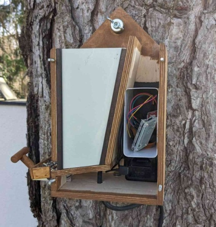
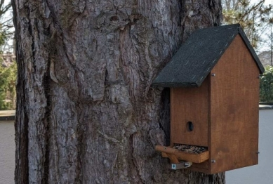
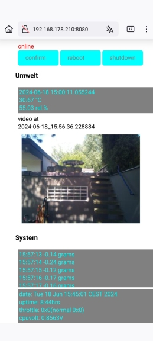
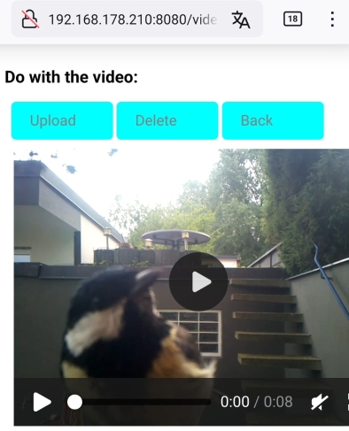

 

This is my [birdiary station](https://www.wiediversistmeingarten.org/view/station/87bab185-7630-461c-85e6-c04cf5bab180) birdhouse. The feeding tray is looking eastward, away from wind and weather. The birdhouse attracts mainly chickadees, no bigger birds. They easily sit besides the sitting pole, so this could be construed more spacious. Tits feed on crops, for other bird species mealworms or insects would have to be added.

 

and this is the view from it's camera as shown in the browser, when using the confirmation script mainAckBird2.py.

See an example video of birds chasing each other: [birdChase](https://dateicloud.de/index.php/s/3ktaDZBxxmaoHbw)
