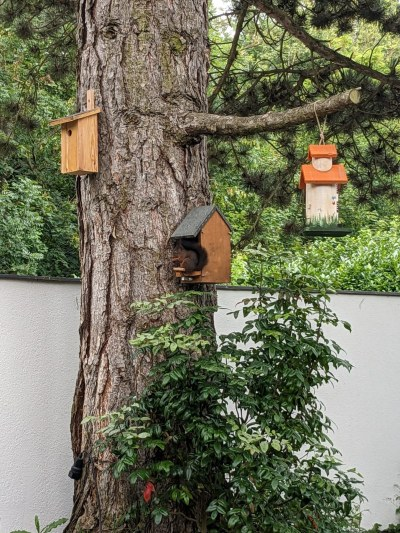

 

This is my [birdiary station](https://www.wiediversistmeingarten.org/view/station/87bab185-7630-461c-85e6-c04cf5bab180) birdhouse. The feeding tray is looking eastward, away from wind and weather. The birdhouse attracts mainly chickadees (10-25 grams), no bigger birds, occasionally a squirrel (100 grams). The bird easily sits beside the sitting pole, so this could be construed more spacious. When it hops to and fro between tray and pole, it may produce quite a batch of videos. Some birds prefer the tree bark or outer sidewall as a hold to reach the tray. For tits to attract, crops are enough, for other bird species mealworms or insects would have to be added.

 

and this is the view from it's camera as shown in the browser, when using the confirmation script mainAckBird2.py.

Watch some interesting [example videos](https://dateicloud.de/index.php/s/TwbjAxpd9xsENSo).

Avoid mounting the camera sideways inside the birdhouse, as picamera2 can flip, but not rotate its view. Some stations also adjusted a near focus, rotating the lens on the V1 camera, before mounting.

Many thanks to Andreas Mischko for the engaged manufacturing of the birdhouse.
