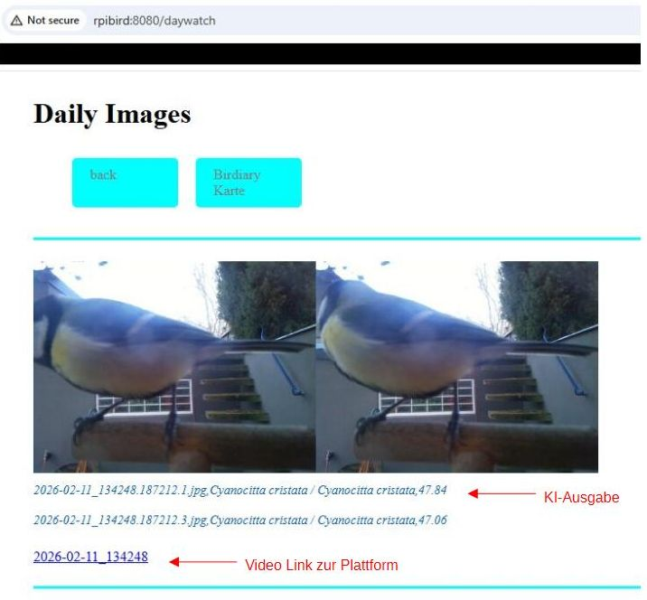

<!--keywords[AI,betzbird,blog,Edge_KI,tflite,tensorflow,pyenv]-->

**KI-Modelle**

Auf Bilder trainierte Modelle bestehen aus einem Input-Knoten für das Bild, einem Knotennetzwerk, deren Verbindungen in ihren Gewichten das Training enthalten, und so vielen Output-Knoten, wie sie Dinge klassifizieren können. Jeder Output-Knoten wirft eine Wahrscheinlichkeit (confidence in %) aus. Entsprechend den Output-Knoten braucht man auch eine sortierte Liste von Labels, die benennen, für welche Vogelart jeder Output-Knoten steht. Die Labels sind im Format `txt` oder `json` oder auch eingebettet auf verschiedene Arten in das `model.tflite`. Vor dem Input muss das Bild (hier RGB 320x240) in das Farb- und Pixelformat (z.B. RGB 224x224) umgewandelt werden, mit dem das Modell trainiert wurde, entweder durch Verzerrung oder besser durch 'centercrop'.

**Labels auf Latein**

Das auf der birdiary Plattform seit 2022 verwendete TFLite Modell beinhaltet 964 Labels an Vogelarten. Ungeachtet der Fehleinschätzungen des Modells ist es auf die wissenschaftliche Vogelklassifizierung trainiert. Diese besteht in lateinischen Bezeichnungen, die so viele Vogelarten unterscheiden, wie es die deutsche oder englische Alltagssprache nicht hergibt. Kohlmeisen werden z.B. lateinisch in mehrere Unterarten unterteilt. Wer das nicht glaubt, sollte mal einen Blick auf die [IOC Klassifizierung](https://www.worldbirdnames.org/) für Vögel werfen. Damit können die lateinischen Namen nur grob ins Deutsche übersetzt werden.

**Setup auf betzBird**

Die Python Library 'picamera2' kann auf dem Raspberry während der Aufnahme eines Vogelvideos im .h264-Format daraus ohne großen Mehraufwand Einzelbilder auskoppeln. Im Menüpunkt 'daywatch' der jetzigen betzBirdiary Version werden maximal 30 Bilder aus jedem Video ausgekoppelt, dann anschließend *lokal auf dem Raspberry demselben TFLite Modell wie auf der birdiary Plattform vorgelegt* und die zwei Bilder mit der höchsten Erkennungswahrscheinlichkeit werden behalten.

Dasselbe passiert dann nochmal zum Vergleich mit dem tflite Model von [LogChirpy](https://github.com/mklemmingen/LogChirpy), einem Projekt zur Vogelerkennung der Uni Reutlingen (übernommen aus [USA](https://github.com/rprkh/Bird-Classifier)). Das LogChirpy tflite hat keine Klasse 'none', und benennt auch einen Kaffeebecher oder sogar leeren Hintergrund als Vogel (mit geringerer confidence).

Bisher wurde auf der birdiary Webplattform nachträglich jeder 10te Videoframe für die KI extrahiert mithilfe des umfangreichen Pythonmodul `cv2` (`api.py line 699`, s.a. Annis `get_frames.py`). Entsprechend der anderen Bildauswahl mit meiner lokalen Methode stimmt die Klassifizierung trotz selbem KI-Modell nicht ganz mit der Plattform überein. Das birdiary Model kam von [Kaggle](https://www.kaggle.com/), ist aber dort mittlerweile gelöscht.

**Trixie Probleme**

Die `TFLite_Runtime` ist im Feb. 2026 noch nicht für das neue Raspberry Trixie (amd64) verfügbar. Die Runtime wird mit `pip` installiert und benötigt nur für sich in einer `pyenv` Umgebung das ältere Python 3.11 und das ältere Numpy 1.26, während die anderen Python Skripte mit Python 3.13 und Numpy > 2 in Trixie laufen. Erst wenn aus dem Trixie Debian Repository ein `apt install python3-tflite_runtime` möglich ist, wird die Runtime samt abhängigen Modulen (wie dem  `deprecated imp`) auf den aktuellen Stand von Trixie angehoben sein.

**Warten auf Annis KI**

Die beiden Vogelmodelle demonstrieren, dass TFLite-Runtime-Modelle auf dem Raspberry4 recht schnell klassifizieren können. Durch die fehlende Vorauswahl deutscher Vogelhaus-Vögel sind beide Modelle aber kaum brauchbar.

Anni Kurkela hat an der Uni Münster im Nov.2025 in ihrer [Masterarbeit](https://github.com/anniquu) ein Vogel-KI-Modell via PyTorch für den ESP32 entwickelt. Leider fand ich das für 16 heimische Vogelarten trainierte PyTorch Modell im Feb.2026 online noch nicht verfügbar. Für den Raspberry 4 ließe sich daraus wohl ein Modell für die Runtime von ONXX oder TFLite ableiten und ökonomisch einbauen. 'Full Tensorflow' ist nur für das Training, nicht aber für die Anwendung des Modells nötig.

Anni's Modell auf noch mehr Vögel zu trainieren, würde ein attraktives Sichtungs- und Labelling-Tool für Vogelbilder voraussetzen, das gern und unkompliziert von allen Vogelhausbetreibern bedient wird. Ein erster Schritt dazu wäre vielleicht eine Erweiterung der birdiary Plattform zum Hochladen klassifizierter Vogelbilder statt oder mit dem Hochladen der immer schwerer zu sichtenden Masse von Videos.

Feedback an herber7be7z@gmail.com