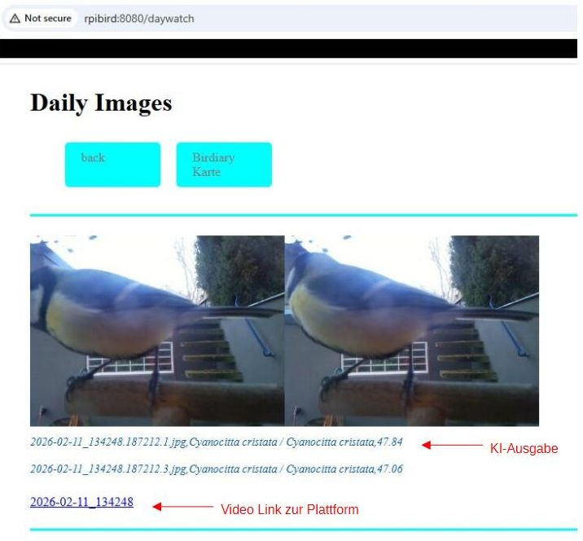

<!--keywords[AI,betzbird,blog,Edge_KI,tflite,tensorflow,pyenv]-->

**KI-Modelle**

Auf Bilder trainierte Modelle bestehen aus einem Input-Knoten für das Bild, einem Knotennetzwerk, deren Verbindungen in ihren Gewichten das Training enthalten, und so vielen Output-Knoten, wie sie Dinge klassifizieren können. Jeder Output-Knoten wirft eine Wahrscheinlichkeit (confidence in %) aus. Entsprechend den Output-Knoten braucht man auch eine sortierte Liste von Labels, die benennen, für welche Vogelart jeder Output-Knoten steht. Die Labels sind im Format `txt` oder `json` oder auch eingebettet auf verschiedene Arten in das `model.tflite`. Vor dem Input muss das Bild (hier RGB 320x240) in das Farb- und Pixelformat (z.B. RGB 224x224) umgewandelt werden, mit dem das Modell trainiert wurde. So erfahren die Bilder beim Einspeisen zum Training und später Anwenden des Modells eventuell folgende Umwandlungen (= *Preprocessing*):

- Einspeisung   'centercrop' (aspect ratio erhalten) oder verzerrtes Bild (stretched).
- Pixelwerte [0..255] (*uint8*) pro Farbkanal werden in *floats* umgewandelt zwischen [0..1] oder [-1..1], weil Modelle damit effektiver lernen. Dazu gibt es 2 Verfahren: *Normalisation* oder *Quantization*. Das häufige *MobileNetV2* von Google verwendet [-1..1] Normalization von 224x224 px Images.
- seltener: Farbmodell (RGB) kann geändert werden. Verschiedene Image-Bibliotheken (Pillow vs. cv2).
- Wird beim Anwenden ein anderes Preprocessing verwendet als beim Training, verblasst die Sicherheit (alle Outputs haben gleich niedrige confidence) oder jedes Bild fällt in dieselbe Gruppe (wie 'none').

Außerdem kann das *Memory Layout* von .tflite Modellen differieren, besonders wenn sie aus anderen Modellen (wie PyTorch) hergeleitet wurden: 
````
layout = NHWC / NCHW
width
height
channels
dtype
````

````
Ein Model funktioniert immer so am besten, wie es trainiert wurde, am besten also auf demselben Device und mit demselben Image Preprocessing. Trainingsdaten von der ESP-Cam mit Fischaugenperspektive (OV2640) sind zu trennen von solchen aus der RaspiCam v1.3 . Wurde centercrop und 224x224px beim Training nicht eingesetzt, dann auch nicht bei der Anwendung. Die label-basierten Modelle liefern keine systematischen Vogelmerkmale wie Schnabelform oder -länge und lassen unklar, wie dies in ihre Bewertung einfließt.
````


**Labels auf Latein**

Das auf der birdiary Plattform seit 2022 verwendete TFLite Modell beinhaltet 964 Labels an Vogelarten. Ungeachtet der Fehleinschätzungen des Modells ist es auf die wissenschaftliche Vogelklassifizierung trainiert. Diese besteht in lateinischen Bezeichnungen, die so viele Vogelarten unterscheiden, wie es die deutsche oder englische Alltagssprache nicht hergibt. Kohlmeisen werden z.B. lateinisch in mehrere Unterarten unterteilt. Wer das nicht glaubt, sollte mal einen Blick auf die [IOC Klassifizierung](https://www.worldbirdnames.org/) für Vögel werfen. Damit können die lateinischen Namen nur grob ins Deutsche übersetzt werden.

**Setup auf betzBird**

Die Python Library 'picamera2' kann auf dem Raspberry während der Aufnahme eines Vogelvideos im .h264-Format daraus ohne großen Mehraufwand Einzelbilder auskoppeln. Im Menüpunkt 'daywatch' der jetzigen betzBirdiary Version werden maximal 30 Bilder aus jedem Video ausgekoppelt, dann anschließend *lokal auf dem Raspberry demselben TFLite Modell wie auf der birdiary Plattform vorgelegt* und die zwei Bilder mit der höchsten Erkennungswahrscheinlichkeit werden behalten.

Dasselbe passiert dann nochmal zum Vergleich mit dem tflite Model von [LogChirpy](https://github.com/mklemmingen/LogChirpy), einem Projekt zur Vogelerkennung der Uni Reutlingen (übernommen aus [USA](https://github.com/rprkh/Bird-Classifier)). Das LogChirpy tflite hat keine Klasse 'none', und benennt auch einen Kaffeebecher oder sogar leeren Hintergrund als Vogel (mit geringerer confidence). Ich habe hier deshalb alles unter 50% confidence empirisch auf 'none' gesetzt.



Bisher wurde auf der birdiary Webplattform nachträglich jeder 10te Videoframe für die KI extrahiert mithilfe des umfangreichen Pythonmodul `cv2` (`api.py line 699` und `scripts/classify_birds.py`, s.a. Annis `get_frames.py`). Meine andere Methode der Bildauswahl, besonders aber ein unterschiedliches Image Preprocessing führen schnell dazu, dass das Resultat sich zwischen Raspberry und Plattform trotz demselben Model deutlich unterscheiden kann. Das birdiary Model kam von [Kaggle](https://www.kaggle.com/), ist aber dort mittlerweile gelöscht. Wie es ursprünglich trainiert wurde, ist unbekannt. ChatGPT meint, es ist typisch für ein Model von *Tensorflow Hub*, das eine obligatorische Bildeingabe im *uint8*-Format intern in die für *MobileNetV2* typische *[-1..1] Normalisation* umwandelt.

**Trixie Probleme**

Die `TFLite_Runtime` ist im Feb. 2026 noch nicht für das neue Raspberry Trixie (amd64) verfügbar. Die Runtime wird mit `pip` installiert und benötigt nur für sich in einer `pyenv` Umgebung das ältere Python 3.11 und das ältere Numpy 1.26, während die anderen Python Skripte mit Python 3.13 und Numpy > 2 in Trixie laufen. Erst wenn aus dem Trixie Debian Repository ein `apt install python3-tflite_runtime` möglich ist, wird die Runtime samt abhängigen Modulen (wie dem  `deprecated imp`) auf den aktuellen Stand von Trixie angehoben sein. Auch das Modul `litert-torch` zur Umwandlung eines PyTorch .pth in ein TFLite Model läuft derzeit noch nur unter Python 3.11 .

Es gibt auch die *Tensorflow Lite C API* . Sie braucht kein Python und kann die `TFLite_Runtime (Python-Modul tflite_runtime.interpreter)` völlig ersetzen. Damit wird vermieden, für Trixie ein älteres Python und Numpy zusätzlich auf dem Raspberry installieren zu müssen.

**Gewinn durch Annis KI_Modell**

All die Vogelmodelle demonstrieren, dass TFLite-Runtime-Modelle auf dem Raspberry4 technisch einfach und gut funktionieren. 'Full Tensorflow' ist nur für das Training, nicht aber für die Anwendung des Modells nötig. Die TFLite-Runtime ist klein in der Installation und schnell bei der Klassifizierung. Bei fehlender Vorauswahl nach deutschen Vogelhaus-Vögeln sind solche Modelle aber inhaltlich kaum brauchbar.

Anni Kurkela hat an der Uni Münster im Nov.2025 in ihrer [Masterarbeit](https://github.com/anniquu) ein [Vogel-KI-Modell](https://github.com/anniquu/TinyBirdiary/tree/main/main/models) auf *Squeezenet* Basis für den ESP32 entwickelt. Es unterscheidet 16 heimische Vogelarten und Mensch und Hintergrund. Für den Raspberry 4 nahm ich erstmal ihr [veröffentlichtes](https://github.com/anniquu/bird-species-classification/tree/main/model/results/unquantized/mobilenet_v3) PyTorch Model `birdiary_v5_mobilenetv3_fine_tuning.pth` (6 MB). Es hätten sowohl das präzisere, aber 80 MB große *EfficientNet* Model als auch *PyTorch* auf dem Raspberry Platz gehabt, aber ich wollte erst die kleinere Lösung testen. Deshalb habe ich das .pth mithilfe Modul `litert-torch` in ein *.tflite float Model* umgewandelt, was ohne Qualitätsverlust einhergehen soll.

Anni's Vorselektion der Vögel und ihr Finetuning des Modells haben sich sicher gelohnt, auch wenn die KI hier immer noch nicht ganz mit der menschlichen Beurteilung mithält. Schließlich ist ja eine Klasse "unknown bird" nicht trainierbar, und ein exotischer Vogel wird ebenfalls einer der 16 Trainingsklassen zugeordnet.

Anni's Modell auf noch mehr Vögel zu trainieren, würde ein attraktives Sichtungs- und Labelling-Tool für Vogelbilder voraussetzen, das gern und unkompliziert von allen Vogelhausbetreibern bedient wird. Ein erster Schritt dazu wäre vielleicht eine Erweiterung der birdiary Plattform zum Hochladen klassifizierter Vogelbilder statt oder mit dem Hochladen der immer schwerer zu sichtenden Masse von Videos.

**Wissenschaftliche morphometrische Vogelklassifizierung**

Neben unseren einfachen *label-basierten* Vogelmodellen gibt es tatsächlich auch eine systematischere KI-Klassifizierung von Vögeln, die auf die Erkennung ihrer *morphometrischen* Unterschiede (Schnabelform, Körperbau) trainiert ist. Die kalifornische Universität San Diego veröffentlichte dazu den Datensatz [CUB-200-2011](https://www.vision.caltech.edu/datasets/cub_200_2011/). Der Datensatz beinhaltet 200 nordamerikanische Vogelarten (keine europäischen Kohlmeisen = Great Tit). Seine Eigenschaften:  ~ 60 Bilder/Art = 11788 Bilder,  500x400 px. Auf jedem Bild ist der Vogel vom Hintergrund freigestellt ("segmentation masks")  und durch *bounding boxes* unterteilt in 15 Körperbereiche ("back-beak-belly-..."). Statt dem Label "Spatz" hat das Modell also Körperteil-Klassen "Spatzrücken- Spatzschnabel-..." und andererseits pro Körperteil diskrete Attribut-Klassen definiert. Insgesamt gibt es 312 Attributklassen, z.B. für den Schnabel "has-bill-color: red-black-..." oder "has-bill-shape: curved-needle-cone-...". Das erhöht natürlich die nötige Anzahl an Trainings- und Testbildern und den menschlichen Markierungsaufwand entsprechend. Konkrete Vogelmodelle, die auf dem *CUB-200-2011* Datensatz beruhen, habe ich bisher nicht gefunden (auf Github, Huggingface). Der *CUB-200-2011* wird als wissenschaftliche Referenz auch nicht mehr erweitert. Dem Datensatz europäische Vogelarten hinzuzufügen, wäre ein privates Projekt.

Feedback an herber7be7z@gmail.com