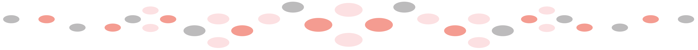

<!--keywords[Birdiary,Github,README,Update]-->

[Inhaltsverzeichnis](contents.md)

Anfang 2024 begann ich, meine Software aus dem [station120423.img](https://uni-muenster.sciebo.de/s/ZZWtPM9miId9ctM)  des [ Birdiary Projektes](https://github.com/Birdiary/station) zu entwickeln. Das Futterhäuschen in Landshut/Niederbayern mit der "Raspicam v3" an einem Raspberry 4B hat eine Sitzstange als Trigger zur Aufnahme von Vogelvideos, die dann an die  [Birdiary Plattform](https://wiediversistmeingarten.org/view/station/87bab185-7630-461c-85e6-c04cf5bab180) hochgeladen werden.

Die Releases meines Raspbian Images stelle ich in die [Cloud](https://drive.google.com/drive/folders/11WduKyMzzzmW61bC7l0BlDjjx6e_ImHC?usp=sharing) . Sie können nach [Anleitung](docs/buildimg/buildimg.md) installiert werden. Öfter stehen dort auch erneuerte Dateien als sogenannte Patches. Mein Code ist natürlich auch auf [Github](https://github.com/herbbetz/betzBirdiary), wo die Dateien ebenfalls aktueller sind als im letzten Image Release. Auch *Github Pages* ist dort aktiviert für einen [Blog](https://herbbetz.github.io/betzBirdiary/) und einer Auswahl von [Bildern](https://herbbetz.github.io/betzBirdiary/station3/mybirds/mybirds.html) und [Videos](https://herbbetz.github.io/betzBirdiary/station3/keep/gallery.html) zur Vogelstation.

Die Dateien im Hauptverzeichnis sind gedacht für das Verzeichnis /home/pi/station3 von einem Raspian OS light (no desktop) auf SD-Karte. Dabei sollte das Verzeichnis station3/ramdisk wegen häufiger Schreibzugriffe als Ramdisk (50MB) gemountet sein. Die einzelnen Dateien meines Hauptverzeichnisses 'station3' sind [hier](filelist.md) erklärt.

Meine Station ist aus dem Heimnetz mit dem Browser ausrufbar unter 'rpibird.local:8080'. Es verwendet die modernen Python Libraries 'picamera2' und 'lgpio' und konnte bis heute problemlos aktualisiert werden mit 'sudo apt update && sudo apt upgrade' bzw. 'pip install --upgrade'. Es sollte damit sogar auf einem RPi5 laufen. 'picamera2' ist noch in Reife und am aktuellsten auf dem hier verwendeten Raspbian OS ["Bookworm"](docs/sysConfig/buildSystem.md). 

Die Codepflege für die Legacy 'picamera' Software habe ich mittlerweile eingefroren. 'picamera2' ist zwar noch in Entwicklung, hat andererseits aber auch vielversprechende Features. 'picamera2' misst z.B. die Tageshelligkeit und passt sich daran an, was einen zusätzlichen Lichtsensor unnötig macht. 

Das Hochladen von Audio erfolgt nur als Dummy, weil von der Birdiary Plattform verlangt. Für Vogelstimmenanalyse verweise auf [BirdNET-PI](https://github.com/mcguirepr89/BirdNET-Pi) und [andere](wav/audio.md). 

Ein handwerklicher Freund hat das [Holzhaus](docs/birdhouse/birdhouse.md) liebevoll gestaltet und später restauriert.

Die Birdiary Plattform besitzt auch eine API, die eine [statistische Auswertung](statist/doc/statsREADME.md) der hochgeladenen Vogeldateien ermöglicht.

Landshut im August 2025, herber7be7z@gmail.com

At the beginning of 2024, I began developing my software from the [station120423.img](https://uni-muenster.sciebo.de/s/ZZWtPM9miId9ctM) of the [ Birdiary project](https://github.com/Birdiary/station). Located in Landshut/Lower Bavaria, the bird feeder, with the "Raspicam v3" on a Raspberry 4B, has a perch as a trigger for recording bird videos, which are then uploaded to the [Birdiary platform](https://wiediversistmeingarten.org/view/station/87bab185-7630-461c-85e6-c04cf5bab180).

I put the releases of my Raspbian image in the [cloud](https://dateicloud.de/index.php/s/KSkjG6K5Nm6BnaH). They can be installed according to the [instructions](buildimg/buildimg.md). Updated files are often available there as so-called patches. My code is also available on [Github](https://github.com/herbbetz/betzBirdiary), where files are more current than in the last image release too. [Github Pages](https://herbbetz.github.io/betzBirdiary/station3/mybirds/mybirds.html) is also enabled there and shows some [bird videos](https://herbbetz.github.io/betzBirdiary/station3/keep/gallery.html). I have just started using Github Copilot.

The files in the main directory are intended for the /home/pi/station2 directory of a Raspian OS light (no desktop) on the SD card. The station2/ramdisk directory should be mounted as a ramdisk (50 MB) due to frequent write access. The individual files in my main directory 'station2' are explained [here](filelist.md).

My station can be accessed from the home network using a browser at 'rpibird.local:8080'. It uses the modern Python libraries 'picamera2' and 'lgpio' and could be easily updated to date with 'sudo apt update && sudo apt upgrade'. However 'picamera2' is still in steep development and is latest on the newest Raspbian OS ["Bookworm"](docs/sysConfig/buildSystem.md).

I have now suspended code maintenance for the legacy 'picamera' software. Audio uploads are only done as a dummy, because they are required by the Birdiary platform. For bird song analysis, refer to [BirdNET-PI](https://github.com/mcguirepr89/BirdNET-Pi).

A handy friend lovingly designed and later restored the [wooden house](docs/birdhouse/birdhouse.md).

The Birdiary platform also has an API that enables [statistical analysis](statist/doc/statsREADME.md) of the uploaded bird files.

Landshut, August 2025, herber7be7z@gmail.com