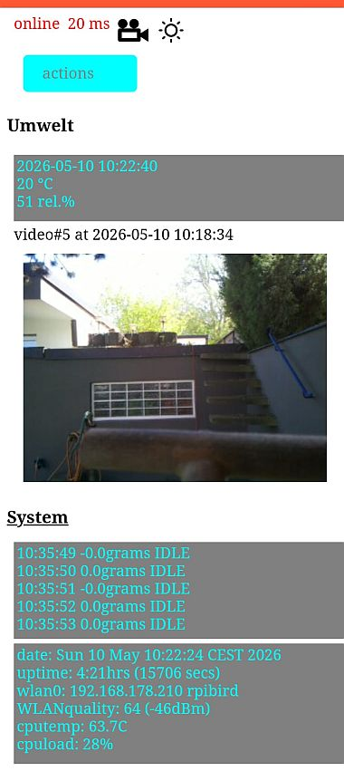
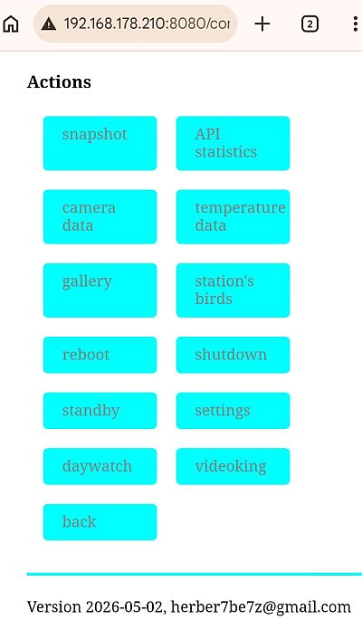
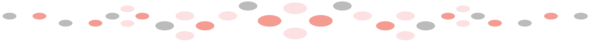

<!--keywords[Birdiary,Github,README,Update]-->

[Inhaltsverzeichnis](contents.md)

Das [Birdiary Projekt](https://github.com/Birdiary/station) der Uni Münster dient der Erkennung von Gartenvögeln durch eine Videokamera in einem [Futterhäuschen](docs/birdhouse/birdhouse.md). Die Vogelvideos werden auf der [Birdiary Plattform](https://wiediversistmeingarten.org/view/station/87bab185-7630-461c-85e6-c04cf5bab180) gesammelt.

Anfang 2024 begann ich, meine eigene Software Version *betzBirdiary* aus dem Dateiimage *station120423.img* der Uni abzuleiten für den Raspberry 4B und die "Raspicam v3". Mein Ziel war eine minimalistische, modularisierte Version, die es mir leicht macht zu experimentieren und auf neue Versionen wie Raspberry Trixie upzudaten. Ich wollte auch ein Webinterface zur Betrachtung meiner Station im Browser und Smartphone.

 

Das Release meines Raspbian Images stelle ich in die [Cloud](https://drive.google.com/drive/folders/11WduKyMzzzmW61bC7l0BlDjjx6e_ImHC) . Es kann wie ein normales Image von *Raspberry Trixie* installiert werden. Mein Code ist auf [Github](https://github.com/herbbetz/betzBirdiary). Auch *Github Pages* ist dort aktiviert für einen [Blog](https://herbbetz.github.io/betzBirdiary/) und einer Auswahl von [Bildern](https://herbbetz.github.io/betzBirdiary/station3/mybirds/mybirds.html) und [Videos](https://herbbetz.github.io/betzBirdiary/station3/keep/gallery.html) zur Vogelstation.

Das Hochladen von Audio erfolgt nur als Dummy, weil von der Birdiary Plattform verlangt. Für Vogelstimmenanalyse verweise auf [BirdNET-PI](https://github.com/mcguirepr89/BirdNET-Pi) und [andere](wav/audio.md).

Landshut im Mai 2026, herber7be7z@gmail.com

The [Birdiary project](https://github.com/Birdiary/station) at Münster University uses a video camera in a [birdhouse](docs/birdhouse/birdhouse.md) to identify garden birds. The bird videos are collected on the [Birdiary platform](wiediversistmeingarten.org/view/station/87bab185-7630-461c-85e6-c04cf5bab180).

In early 2024, I started developing my own software version *betzBirdiary* based on the *station120423.img* file image from the university for the Raspberry 4B and the "Raspicam v3". My goal was to create a minimalist, modular version that would make it easy for me to experiment and update to new versions such as Raspberry Trixie. I also wanted a web interface to view my station in a browser and on my smartphone.

You can find the Release of my image in the [cloud](https://drive.google.com/drive/folders/11WduKyMzzzmW61bC7l0BlDjjx6e_ImHC) and install it in the same way as the usual image of *Raspberry Trixie*.

Landshut, Mai 2026, herber7be7z@gmail.com