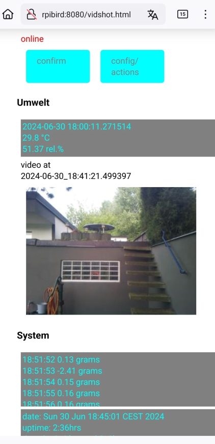
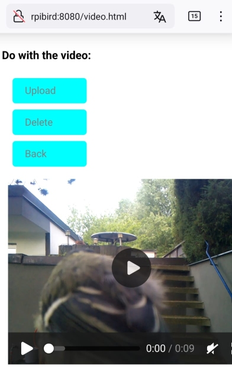

<!--keywords[acknowledge,confirm_version,Historie,Videovoransicht]-->

Der Code in diesem Verzeichnis gehört zu einer betzBirdiary Version, wo man Umschalten konnte von dem direkten Upload mit mainFoBirdX.py zu mainAckBirdX.py. Letztere informiert auf dem Webinterface über ein neues Video, das aber erst in der Voransicht 'video.html' als .mp4 betrachtet wird. Dort kann man dann entscheiden, es weiter zur Birdiary Plattform hochzuladen oder es in /keep zu behalten oder es zu verwerfen.

siehe auch letzte Schemazeichnung in [ForkMakingof.md](../docs/makingOf/ForkMakingof.md) .

Die Anpassung aller in /acknowledge enthaltenen Dateien war dazu nötig. Da die Funktion selten verwendet wird, habe ich die Pflege der dazu nötigen Skripte eingestellt.

Hier ein [Bedienungsvideo](birdGUI.mp4) und das damalige Webinterface:

  