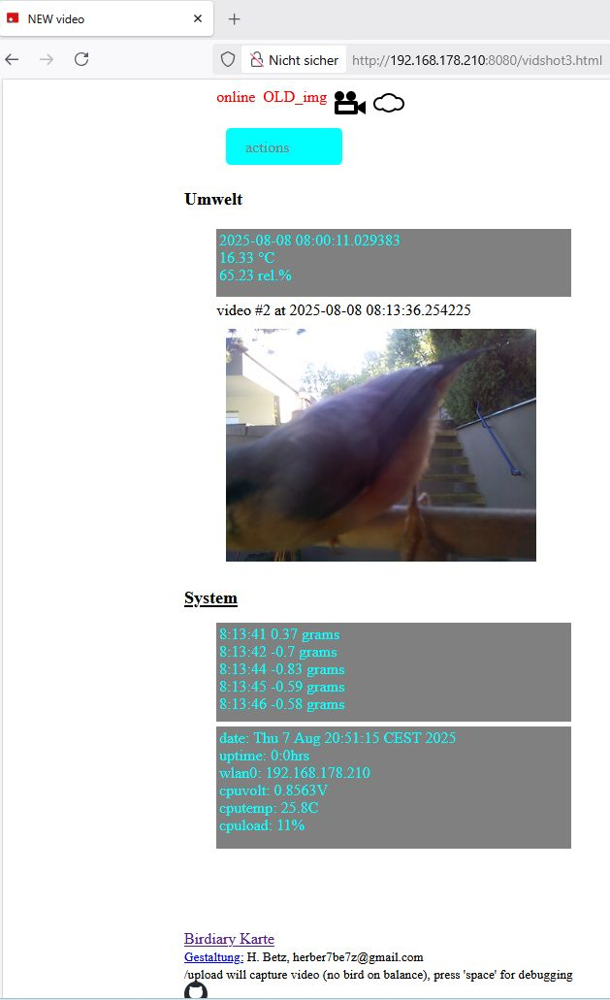
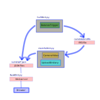

<!--keywords[blog,Bookworm,davidplowman,Installation,Luxmessung,picamera2]-->

Mein Klon *betzBirdiary* der Uni Münster Software vom März 2023 hat diese in mehrere Pythonskripte mit speziellen Funktionen aufgeteilt: ein Skript für den Dehnmesstreifen und seinen hx711-Analog-Digital-Konverter teilt dem *main* Picamera2 Skript mit, wenn ein Vogel es über die Sitzstange getriggert hat. Das main Skript macht dann das Video und lädt es hoch in die Birdiary Internet Plattform. Ein Temperatursensor lädt unabhängig davon alle 15 Minuten seine DHT22-Daten über ein weiteres Skript hoch. Als Eigentümer der Station habe ich über ein Webinterface eine Sichtmöglichkeit durch die Kamera. Das Webinterface besteht aus einem Flask Server. Programmiert ist das meiste in Python3, manches in bash Shell Skripten. Die Kommunikation zwischen den Skripten findet auf der *Ramdisk* statt, um die SD-Karte zu schonen. Sie erfolgt dort über eine Unix *FIFO* und eine zentrale *JSON* Datei.

Ohne die Aufteilung in Einzelfunktionen wäre es für mich schwer gewesen, die Software auf das neuere Raspbian *bookworm* (ohne Desktop) zu portieren. Und auch Komfortfunktionen wie statistische Darstellungen der Vogelaktivität aus den Daten der birdiary Plattform oder eine Aufzeichnung der Tageslichtschwankungen hätten sich nicht ergeben. Diese sind jetzt im Webinterface über den Button *actions* erreichbar. Dort gibt es auch eine *Standby* Funktion, die die Sitzstange abschaltet, wenn ich ohne Aufnahme das Futter nachfüllen will. Klicke dazu auf das Kamerasymbol.

**Picamera2**

Cool fand ich anfangs die neuentdeckte Freiheit, die Kamerabelichtung selbst einstellen zu können. Nach einer Testphase mit vielen falsch belichteten Videos und auf Rat von [davidplowman](https://github.com/raspberrypi/picamera2/issues/1305) verlasse ich mich jetzt aber wieder auf die eingebaute Kamerabelichtung.

Die Aufzeichnung der Lichtmessungen über die Kamera (Raspicam v3) findet konstant statt, während kein Video aufgenommen wird und ich das Webinterface nicht gerade für die Kamerasicht verwende. Letzteres registriert der *Flask* Webserver und kommuniziert es an das Picam *main* Skript, das dann Bilder für das Webinterface liefert, bis mal wieder ein Vogel eine Videoaufnahme in dem Skript auslöst.

**Installation**

Das neue *bookworm* Image von *betzBirdiary* findet sich in der [Cloud](https://drive.google.com/drive/folders/11WduKyMzzzmW61bC7l0BlDjjx6e_ImHC?usp=sharing) und wird nach dem Download auf die SD-Karte geflasht, z.B. mit *balena Etcher*. Nach dem Hochfahren im Raspberry 4 oder 5 baut es zunächst einen WLAN-Hotspot auf namens *bird-ap210*, in den man sich per Laptop einloggt mit dem WLAN-Passwort *bird24root*. Der Hotspot hat die IP *192.168.4.1*. Über *ssh pi@192.168.4.1* ist die Konsole erreichbar (Login-Passwort: *bird24*).

Eine kleine Herausforderung ist die Umkonfiguration vom Hotspot auf das Heim-WLAN.
*nmtui* ist das Kommandozeilen-GUI des *NetworkManager*s von *bookworm*.  Ich habe zwei Konfigurationen hinterlegt, das aktive *bird-ap-dhcp* für den Hotspot und das *bird-static210*. Um letzteres mit den eigenen WLAN-Daten zu versehen und dann zu aktivieren, empfehle ich mein Skript mit *sudo ./wlan-yaml.sh wlan.yml* aufzurufen, nachdem dieses *wlan.yml* auf die eigenen Werte angepasst wurde. Umkonfigurieren mit *nmtui* machte mir Probleme. Nach *sudo reboot* sollte der Zugang im Heimnetz mit sowas wie *ping 192.168.178.210* oder *ssh pi@192.168.178.210* oder im Browser auf *http://192.168.178.210:8080* funktionieren bzw. mit der selbst eingetragenen *IP*.

Funktioniert diese online Konfig nicht, ist da noch die Möglichkeit, die SD-Karte mit einem USB-Lesegerät an einen Ubuntu-Laptop zu stecken. Als Ubuntu *root*  kommt man dann auch ans *rootfs* (bei mir */media/herb/rootfs/etc/NetworkManager/system-connections*) und trägt in die *bird-static210* WLAN-Konfiguration *autoconnect-priority=100* ein, in die andere *autoconnect-priority=0*. Damit wird *bird-static210* bevorzugt und bei Scheitern auf das *bird-ap-dhcp* WLAN ausgewichen.

In */home/pi/station3/config.json* muss man noch seine *boxId* (eigene Kennung für die birdiary Internet Plattform) eintragen und rebooten. Die anderen Parametern von *config.json* sind erklärt in *configjson.md*. Wie oben bei *wlan.yml* kann man auch hier ein eigenes *config.yml* erstellen, das mit *config-yaml.sh config.yml* String-Werte in das *config.json* überträgt.

**Ausblick**

*bookworm*  (Debian 12) hat noch weitere Neuerungen zum Standard gemacht wie boot Management mit *.service* Dateien oder das *Python Venv*. Debian 13 "Trixie" lauert auch schon. Die Portierung auf das neueste Raspbian bringt etliche Umstellungen, aber auch bessere Unterstützung für die neuesten Versionen von *picamera2*. Vielleicht möchte jemand den Desktop nachinstallieren oder MQTT oder Docker? Wer mir seine Erfahrungen mit *betzBirdiary* berichtet, den kann ich auch schneller über Fixes informieren. Meine Mail lautet *herber7be7z@gmail.com*. Happy Birding!
