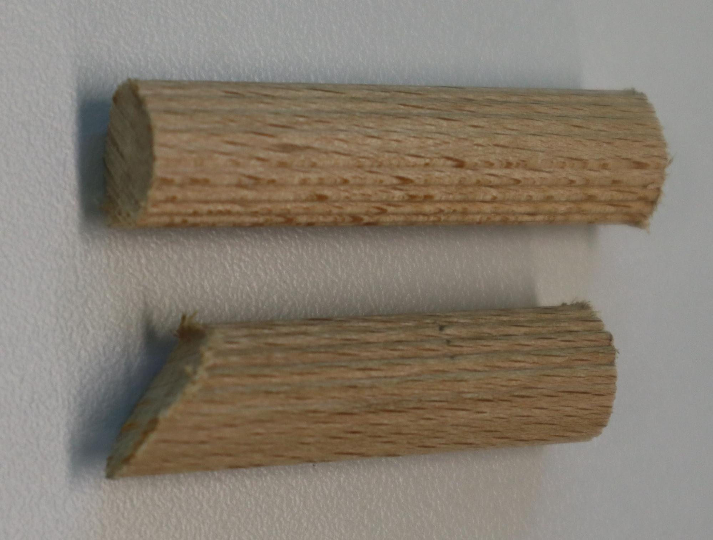
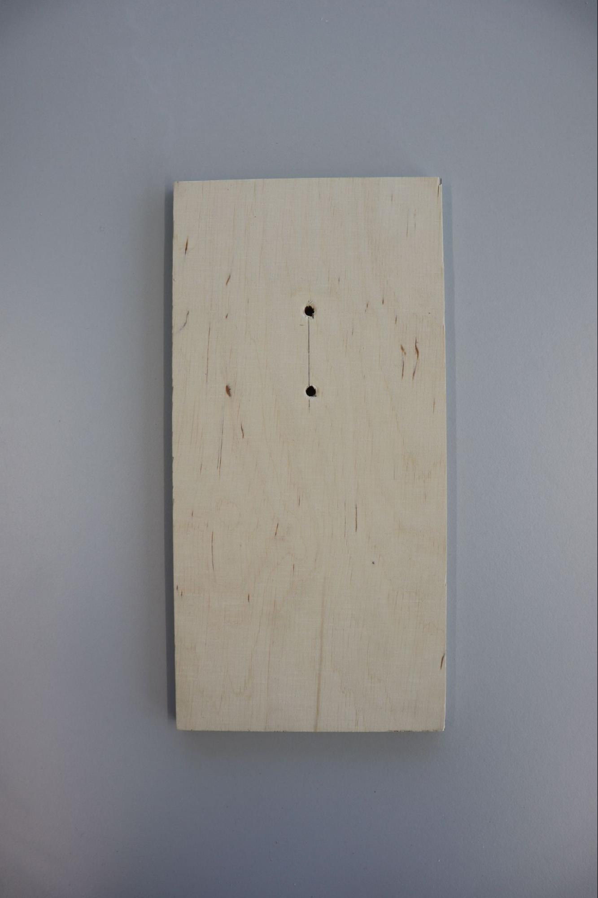
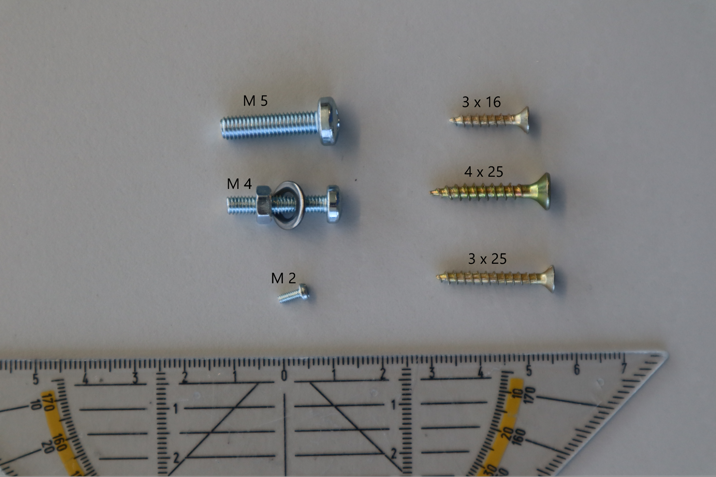

| Teil | Anzahl | Shop |
| --- | --- | --- |
| RaspberryPi 4 B, 2 GB Kit | 1 | [BerryBase](https://www.google.com/url?q=https://www.berrybase.de/raspberry-pi-4-computer-modell-b-2gb-elementary-kit?c%3D2383&sa=D&source=editors&ust=1749468971152614&usg=AOvVaw2yQCLE9PYzm_o5aOymM1JJ) |
| Netzteil (nicht nötig, da im Kit enthalten) | 1 | ([BerryBase](https://www.google.com/url?q=https://www.berrybase.de/offizielles-raspberry-pi-usb-c-netzteil-5-1v/3-0a-eu-schwarz&sa=D&source=editors&ust=1749468971153612&usg=AOvVaw2GyjEZRV7mdvTBzSWFUxso)) |
| Micro SD-Karte, 32 GB | 1 | [BerryBase](https://www.google.com/url?q=https://www.berrybase.de/sandisk-extreme-micro-sdhc-a1-uhs-i-u3-speicherkarte-43-adapter-32gb&sa=D&source=editors&ust=1749468971154528&usg=AOvVaw2BN6hSzC8caIZPYlYdwdq3) |
| Raspberry Pi Kamera v2(Achtung, es existieren verschiedene Versionen der Raspberry Pi Kamera. Damit alles reibungslos funktioniert, nutzt bitte das “Raspberry Pi Camera Module 8MP v2”. Die Experimentierfreudigen unter euch können natürlich auch die anderen Versionen nutzen, allerdings kann es dann zu Anpassungsbedarf bei der Software kommen.) | 1 | [BerryBase](https://www.google.com/url?q=https://www.berrybase.de/raspberry-pi-camera-module-8mp-v2&sa=D&source=editors&ust=1749468971156142&usg=AOvVaw0QCPVWUHDj478fMk7RBJTi) |
| Flexkabel 0,5 m | 1 | [BerryBase](https://www.google.com/url?q=https://www.berrybase.de/flexkabel-f-252-r-raspberry-pi-kameramodul/display?number%3DRPIC-FLEX-50&sa=D&source=editors&ust=1749468971157225&usg=AOvVaw0BxTRMFLmccbJ-_tRgv9Dt) |
| Dehnungsmessstreifen Wägezelle 1 kg | 1 | [BerryBase](https://www.google.com/url?q=https://www.berrybase.de/dehnungsmessstreifen-w-228-gezelle-1kg&sa=D&source=editors&ust=1749468971158327&usg=AOvVaw1TEYEzIdzgWZWZ9yYIYyXz) |
| Gewichtssensor (zwei verschiedene Optionen, wobei nur eine von den beiden benötigt wird; Variante mit M5Stack empfohlen) | HX711 Breakout Board | 1 | [BerryBase](https://www.google.com/url?q=https://www.berrybase.de/hx711-24-bit-a/d-gewichtssensor&sa=D&source=editors&ust=1749468971159475&usg=AOvVaw3VNiAyLld4RXWGejXNGsro) |
| M5Stack + Adapterkabel | jeweils 1 | [BerryBase](https://www.google.com/url?q=https://www.berrybase.de/m5stack-mini-wiegeeinheit-hx711-waegezellen-verstaerker&sa=D&source=editors&ust=1749468971160423&usg=AOvVaw2MsUd-_K5UJ5KbtgKEfqAX)+[BerryBase](https://www.google.com/url?q=https://www.berrybase.de/seeed-grove-adapterkabel-4-pin-dupont-female-4-pin-grove-stecker-5er-pack&sa=D&source=editors&ust=1749468971160584&usg=AOvVaw1eucBmpFM-dqPF6MwET1v4) |
| Mikrofon | 1 | [BerryBase](https://www.google.com/url?q=https://www.berrybase.de/adafruit-i2s-mems-mikrofon-breakout-sph0645lm4h&sa=D&source=editors&ust=1749468971161675&usg=AOvVaw3M_xDYVQN2Xu5mT6eIcLzZ) |
| DHT22 (Temperatur und Luftfeuchtessensor) | 1 | [BerryBase](https://www.google.com/url?q=https://www.berrybase.de/dht22-digitaler-temperatur-und-luftfeuchtessensor-mit-breakout-board-jumperkabeln-40-f-f-41&sa=D&source=editors&ust=1749468971162657&usg=AOvVaw2d4BYFl-AEdDSHvyehk3Qt) |
| Micro HDMI Adapter (optional) | 1 | [BerryBase](https://www.google.com/url?q=https://www.berrybase.de/micro-hdmi-adapterkabel-d-stecker-a-buchse-15cm-schwarz&sa=D&source=editors&ust=1749468971163642&usg=AOvVaw1EBALm-cErB4Ch9Q_4yalW) |
| Kabel 20 cm | 9 | [BerryBase](https://www.google.com/url?q=https://www.berrybase.de/40pin-jumper/dupont-kabel-female-150-female-trennbar?number%3DDUPK-40-FF-20&sa=D&source=editors&ust=1749468971164533&usg=AOvVaw1qwdFXb3EJRM786tQUJEWn)(40 Stück) |
| Kabel 10 cm | 4 | [BerryBase](https://www.google.com/url?q=https://www.berrybase.de/40pin-jumper/dupont-kabel-female-150-female-trennbar&sa=D&source=editors&ust=1749468971165455&usg=AOvVaw39754swshUWcgEp7rF99FD)(40 Stück) |
| Kamera Halterung | 1 | [GitHub](https://www.google.com/url?q=https://github.com/Birdiary/station/blob/main/files/Cam_Support.stl&sa=D&source=editors&ust=1749468971166465&usg=AOvVaw3FFini9HcG2L5h07oSced3)OpenSource |
| Filament für 3D-Druck |  | z.B.[3DJake](https://www.google.com/url?q=https://www.3djake.de/extrudr/green-tec-pro-carbon?sai%3D5263&sa=D&source=editors&ust=1749468971167471&usg=AOvVaw0zSxNUJ6dsd6rCnYb60FEo) |
| Holz, Multiplex (Birke) 9 mm | 0,5 m² | [Hornbach](https://www.google.com/url?q=https://www.hornbach.de/shop/Multiplexplatte-Birke-BB-WG-1250x2500x9-mm-Zuschnitt-online-reservierbar/7141310/artikel.html&sa=D&source=editors&ust=1749468971168408&usg=AOvVaw0nTiwA8R8lDL4GbPf7CKT4) |
| M2x5 Schrauben (DIN 84) (optional) | 2 | [Conrad](https://www.google.com/url?q=https://www.conrad.de/de/p/toolcraft-888673-zylinderschrauben-m2-5-mm-schlitz-din-84-stahl-verzinkt-1-st-888673.html&sa=D&source=editors&ust=1749468971169406&usg=AOvVaw3w_yl9FnX7T_L89BOS-AgE) |
| Schrauben zum Anbringen der Halterung / Riegelschlaufe (in Abhängigkeit zur Größe der Schlaufe z.B. M4 Schraube) | 2 | [Hornbach](https://www.google.com/url?q=https://www.hornbach.de/shop/Linsenkopfschraube-m-Kreuzschlitz-DIN-7985-4x20-mm-Edelstahl-A2-100-Stueck/5217746/artikel.html&sa=D&source=editors&ust=1749468971170476&usg=AOvVaw07hZLjnhM6RU9s7QXH5XO6)(100 Stück) (plus[Muttern](https://www.google.com/url?q=https://www.hornbach.de/shop/Sechskantmutter-DIN-934-M4-galv-verzinkt-100-Stueck/3830632/artikel.html&sa=D&source=editors&ust=1749468971170659&usg=AOvVaw1-um-IwkOAeAuPf1ybmC9C)) |
| M5 x 20 Schraube | 1 | [Hornbach](https://www.google.com/url?q=https://www.hornbach.de/shop/Linsenkopfschraube-4-8-m-Kreuzschlitz-DIN-7985-5x20-mm-galv-verzinkt-100-Stueck/3831276/artikel.html&sa=D&source=editors&ust=1749468971171691&usg=AOvVaw2qCWAluSzn8db5vkXk3Amy)(100 Stück) |
| Unterlegscheiben (M5) | 4 | [Hornbach](https://www.google.com/url?q=https://www.hornbach.de/shop/Unterlegscheibe-DIN-125-5-3-mm-Edelstahl-A2-100-Stueck/3836693/artikel.html&sa=D&source=editors&ust=1749468971172668&usg=AOvVaw3xdPBxzly_a67Zz-PoArfZ)(100 Stück) |
| Spax 3 x 16 | 4 | [Hornbach](https://www.google.com/url?q=https://www.hornbach.de/shop/JD79-Spanplattenschraube-3x16-mm-galv-verzinkt-gelb-chromatiert-200-Stueck/3834784/artikel.html&sa=D&source=editors&ust=1749468971173791&usg=AOvVaw3vkex4SKI1Y_BsYYd5Y05I) |
| Spax 3 x 25 (lässt sich auch gut durch 3 x 16 Schrauben ersetzen) | 26 | [Hornbach](https://www.google.com/url?q=https://www.hornbach.de/shop/JD79-Spanplattenschraube-3x25-mm-galv-verzinkt-gelb-chromatiert-200-Stueck/3834786/artikel.html&sa=D&source=editors&ust=1749468971174836&usg=AOvVaw1C1tI2KxrHEkIDMwXeRZqs) |
| Spax 4 x 25 | 2 | [Hornbach](https://www.google.com/url?q=https://www.hornbach.de/shop/JD79-Spanplattenschraube-4x25-mm-galv-verzinkt-gelb-chromatiert-200-Stueck/3834801/artikel.html&sa=D&source=editors&ust=1749468971175812&usg=AOvVaw2HYqToBt7luHxyg0klubqO) |
| Riegelschlaufe | 1 | [Hornbach](https://www.google.com/url?q=https://www.hornbach.de/shop/Schlaufe-fuer-Riegel-15-x-49-mm-Galv-gelb-verzinkt/2880913/artikel.html&sa=D&source=editors&ust=1749468971176714&usg=AOvVaw3CmXRUioSdZHa3YloT48no)(Löcher M3) |
| Schlauchschelle (optional) | 1 |  |
| Sicherheitsbox | 1 | [Hellweg](https://www.google.com/url?q=https://www.hellweg.de/sicherheitsbox-ip44-orange/572823&sa=D&source=editors&ust=1749468971178454&usg=AOvVaw26p1TPtuz60qGAh1fPKGrV)[Hornbach](https://www.google.com/url?q=https://www.hornbach.de/shop/Safe-Box-IP44-fuer-Stecker-Kupplung-gelb-Brennenstuhl/7671585/artikel.html&sa=D&source=editors&ust=1749468971178614&usg=AOvVaw2hb_DDXDRDGwbdGTd9CqEJ) |
| Holz Sitzstange (Riffelstab 12 mm) | 20 cm | [Hornbach](https://www.google.com/url?q=https://www.hornbach.de/shop/Riffelstab-Konsta-Buche-roh-12-mm-L1000-mm/5485769/artikel.html&sa=D&source=editors&ust=1749468971179550&usg=AOvVaw2xavGN5UQYQV7_VobCbjUo) |
| Dachpappe | ca. 18 x 40 cm | z.B.[Hornbach](https://www.google.com/url?q=https://www.hornbach.de/shop/Quandt-Bitumen-Dachpappe-Qualitekt-333-gr-m-besandet-10-x-1-m-Rolle-10-m/258026/artikel.html&sa=D&source=editors&ust=1749468971180537&usg=AOvVaw0_6xeAGA5AA_jVXJvrINNN) |
| Plexiglas | 3 x 3 cm | [Hornbach](https://www.google.com/url?q=https://www.hornbach.de/shop/Hobbyglas-2x250x500-mm-glatt-klar/1477798/artikel.html&sa=D&source=editors&ust=1749468971181504&usg=AOvVaw0YoiZf7Gm6nCyN2RV8ZfLe) |
| PVC Hartschaumplatte (als Futterrand, optional) 2 mm dick | ca. 1,5 x 15 cm | [Distrelec](https://www.google.com/url?q=https://www.distrelec.de/de/pvc-schaumplatte-980mm-700kg-1000n-mm-no-brand-pvc-kmatex-weiss980x500x2mm/p/14821877&sa=D&source=editors&ust=1749468971182590&usg=AOvVaw3zLtd_cHc3XLu0IbjiHSo_) |
| Tackernadeln | ca. 30 |  |
| Lötzinn | nach Bedarf |  |
| Montagekleber | nach Bedarf | [Hornbach](https://www.google.com/url?q=https://www.hornbach.de/shop/Pattex-Montagekleber-Power-250-g/5481545/artikel.html&sa=D&source=editors&ust=1749468971185042&usg=AOvVaw1r7hUFxjE7FsGNhqVYAJ95) |
| Farbe | nach Bedarf |  |
| Zeichnung Seitenwand | Zeichnung Front |
| --- | --- |
|  |  |
| Raspberry Pi | Kamera (inkl. Flexkabel, Gehäuse aus3D-Druckerund Plexiglasscheibe) | DHT 22 |
| --- | --- | --- |
|  |  |  |
| Waage (Dehnungsmessstreifen +Gewichtssensor) | Mikrofon | Kabel (oben: USB-C Netzteil, unten: Micro-HDMI Adapter) |
|  |  |  |
| Vorher | Nachher |
| --- | --- |
|  |  |
| Zwischenschritt | Ergebnis |
| --- | --- |
|  |  |
| Ergebnis |
| --- |
|  |
| Vorher | Nachher (die vier Löcher in der Mitte ignorieren) |
| --- | --- |
|  |  |
| Vorher | Nachher |
| --- | --- |
|  |  |
| Vorher | Nachher |
| --- | --- |
|  |  |
| Vorher | Nachher |
| --- | --- |
|  |  |
| Vorher | Nachher |
| --- | --- |
|  |  |
| Vorher | Nachher |
| --- | --- |
|  |  |
| Vorher | Nachher |
| --- | --- |
|  |  |
| Vorher | Nachher |
| --- | --- |
|  |  |
| Vorher | Nachher |
| --- | --- |
|  |  |
| Vorher | Nachher |
| --- | --- |
|  | und |
| Vorher | Nachher |
| --- | --- |
|  |  |
| Vorher | Nachher |
| --- | --- |
|  |  |
| Vorher | Nachher |
| --- | --- |
|  |  |
| Nachher |
| --- |
|  |
| Vorher | Nachher |
| --- | --- |
|  |  |
| Vorher (plus restliche Station) | Nachher (plus restliche Station) |
| --- | --- |
|  |  |
| Ergebnis |
| --- |
|  |
| Ergebnis (ABER: Sensor soll nachher außerhalb sein) |
| --- |
|  |
| Ergebnis (ABER: Sensor soll nachher außerhalb der Station sein) |
| --- |
|  |
| Vorher (Pi liegt eigentlich in der Station) | Nachher |
| --- | --- |
|  |  |
| Terminal | Browser | Datei Manager |
| --- | --- | --- |
|  |  |  |
| Ergebnis |
| --- |
|  |
Anleitung für den Bausatz einer smarten Vogelfutterstation
# Anleitung für den Bausatz einer smarten Vogelfutterstation
# 
#
Die smarte Vogelfutterstation wurde im Rahmen des “Wie divers ist mein Garten?” Forschungsprojektes an der Universität Münster entwickelt. Im Folgenden wird eine Anleitung zur Verfügung gestellt, die den eigenständigen Aufbau der Station ermöglicht. Benötigte Materialien, Werkzeuge, sowie Arbeitsschritte werden detailliert erläutert. Der Aufbau sollte für jegliche Bürger*innen mit dem üblichen Werkzeug einer Heimwerkstatt möglich sein. Alle weiteren Informationen zum Projekt sind auf[https://www.wiediversistmeingarten.org/](https://www.google.com/url?q=https://www.wiediversistmeingarten.org/&sa=D&source=editors&ust=1749468971148656&usg=AOvVaw3fWLTODbWMajDzv0kPOYrM)verfügbar.
Die Anleitung wurde nach bestem Wissen und Gewissen erstellt, wir übernehmen keine Haftung für Funktionsweise der Station bzw. Schäden, die beim Aufbau der Station entstehen. Bei Fragen ist das Projektteam unter[info@wiediversistmeingarten.org](mailto:info@wiediversistmeingarten.org)erreichbar. Wir freuen uns über Verbesserungsvorschläge bzgl. der Anleitung oder jegliche Ideen und Anregungen, die ihr uns unter oben genannter Email-Adresse gerne mitteilen könnt. Im Verlauf des Projektes hat sich zudem eine Community smarter BirdWatcher zusammengefunden, die sich über die Plattform Discord austauschen. Bei Interesse dieser Community beizutreten kannst du über folgenden Link beitreten:[https://discord.com/invite/fnweNprGH4](https://www.google.com/url?q=https://discord.com/invite/fnweNprGH4&sa=D&source=editors&ust=1749468971150213&usg=AOvVaw3RWcStCAABnGewRPWfy-RI).
#
# Materialien
## Hardwareliste
Nicht immer sind alle Komponenten bei BerryBase erhältlich, als Alternativen empfehlen wir folgende Shops:
[conrad.de](https://www.google.com/url?q=https://www.conrad.de/&sa=D&source=editors&ust=1749468971186412&usg=AOvVaw0hLQEndHVA1mmoZWqMMduY)
[eckstein-shop.de](https://www.google.com/url?q=https://eckstein-shop.de/&sa=D&source=editors&ust=1749468971186580&usg=AOvVaw1dc-ts7IA5K-b36NrzfnLM)
[welectron.com](https://www.google.com/url?q=https://www.welectron.com/&sa=D&source=editors&ust=1749468971186721&usg=AOvVaw3CNf0MFtYHrjkIcOn6HJs0)
[reichelt.de](https://www.google.com/url?q=https://www.reichelt.de/&sa=D&source=editors&ust=1749468971186853&usg=AOvVaw0b5jXTgBxPgelDbJYYV8GI)
[rasppishop.de](https://www.google.com/url?q=https://www.rasppishop.de/&sa=D&source=editors&ust=1749468971186989&usg=AOvVaw2tJ3usIVBUbHu8K5P7Hc34)
## Benötigte Holzteile
2 x Seitenwand: 345 x 190 mm (mit 90 Grad Spitze oben)
Frontwand: 120 x 190 mm (Bohrung für die Kamera)
Rückwand: 120 x 250 mm
(Achtung der Winkel der Seitenwände muss dann wirklich exakt 90 Grad sein, im Zweifel ggf. die Höhe der Rückwand etwas minimieren, z.B. auf 245 mm)
Boden: 120 x 180 mm (Löcher für Befestigung Waage und Kabel)
Siloboden: 120 x
135
mm
Zwischenwand: 120 x 210 mm
Dach vorne: 150 x 200 mm
Dach hinten: 150 x 155 mm
3 x “Riegel”: 120 x 25 mm
##
## Benötigtes Werkzeug
Akku-Bohrschrauber
Bohrer:
3,3 mm
5 mm
8 mm
Kegelsenker (z.B. 12 mm)
Schraubendreher
Tacker
Säge (bei eigenständigem Zuschneiden des Holzes)
Lötkolben
3D-Drucker
Zollstock / Maßband o.ä.
Cuttermesser
Gewindebohrer M2 (optional)
Tastatur
Maus
## Bilder
### (Fast) Alle Materialien
# 
### Schrauben
# 
### Technik
# Holzbau
## Vorbereitung
### Anstreichen der Holzteile
Bauteile: alle Holzteile, Farbe
Aufgabe: Anstreichen
Arbeitsschritte:
Wenn du möchtest, kannst du deine Station streichen, dadurch wird sie wetterfester und langlebiger.
Nutze ausreichend Plane zum Unterlegen.
Streiche deine Station komplett an
. Wir empfehlen die Nutzung von handelsüblichem Leinöl oder aber die Nutzung einer Holzlasur. Alternativ kann man auch einen farbigen Lack nutzen.
Wiederhole den Streich-Vorgang nach eigenem Ermessen.
Alternativ kann die Station auch im Anschluss an den Zusammenbau gestrichen werden, beachte allerdings, dass Teile ggf. wieder ausgebaut werden müssen oder nicht vollständig gestrichen werden können.
###
### Löcher in Bodenplatte bohren
Bauteil: Boden
Aufgabe: Löcher bohren
Arbeitsschritte:
Das Ergebnis dieses Arbeitsschrittes kannst du auf den Bildern des nächsten Schrittes sehen
Bohre ein Loch, an dem später der Dehnungsmessstreifen angebracht wird
Das Loch sollte mit einem
5 mm
Bohrer, mittig mit ca. 1 cm Abstand zum Rand gebohrt werden
Bohre ein Loch, durch das du später die Kabel stecken kannst, die nach draußen gehen
Das Loch sollte groß genug sein, um das USB-C Kabel durch zu schieben (min. 7,5 x
14
mm)
Es sollte sich mittig in einem Abstand von ca. 7 cm vom Rand befinden
Um möglichst wenig Raum für das Eindringen von Umwelteinflüssen (Insekten, Wetter, …) zu lassen, solltest du das Loch nicht größer als nötig machen.
Bohre am besten 2 Löcher mit jeweils min. 7,5 mm Durchmesser direkt nebeneinander und verbinde die Beiden, z.B. mit Hilfe einer Pfeile
Alternativ bohre direkt ein Loch mit einem Durchmesser von 14 mm
### Sitzstange bauen
Material: Holzstange (Riffelstab 12 mm), Schraube 3 x 25, Kleber (optional)
Schneide von der Holzstange 2 Stücke ab (siehe Bild)
1 x 6 cm lang
1 x 5 cm lang, inkl. einer Seite mit einem
45 Grad Schnitt
Falls du eine Fräse oder einen Standbohrer hast, kannst du in die gerade Seite zusätzlich noch eine Kerbe bohren, in der dann das 6 cm Stück liegt
Bohre durch das 6 cm Stück mittig ein Loch (ca. 3 mm dick)
Schraube das 6 cm Stück an die gerade Seite des 5 cm Stücks
Bohre ggfs. ein kleines Loch im 5 cm Stück vor (z.B. 1-2 mm dick)
### Loch in Waage-Riegel schneiden
Säge / Bohre in einen der Holz-Riegel (120 x 25 mm) ein Loch, durch das der Dehnungsmessstreifen passt
Mittig, min. 15 x 15 mm
###
### Zuschnitt Futterrand
Schneide den Streifen zu, der das Futter vorm Herunterfallen schützen soll
Hier kannst du verschiedene Materialien verwenden
z.B. eine dünne PVC Hartschaumplatte (siehe Materialliste)
es sollte aber auch mit einem Plastikstreifen, z.B. von einem Schnellhefter möglich sein
Schneide das Material in einen ca. 1,5 cm breiten und min. 14 cm langen Streifen
### Zuschnitt Dachpappe
Schneide die Dachpappe auf die vorgegebenen Maße zu (ca. 18 x 40 cm)
Nutze dazu z.B. ein Cuttermesser und denke an eine Unterlage
### Zuschnitt Plexiglas
Schneide dir ein quadratisches Plexiglas mit den Maßen 30 x 30 mm zurecht
### 3D Druck
Drucke die
[Halterung](https://www.google.com/url?q=https://github.com/Birdiary/station/blob/main/files/Cam_Support.stl&sa=D&source=editors&ust=1749468971212053&usg=AOvVaw2PKnJFGKGOHfWhaLDpL5PU)
für die Kamera mit einem 3D-Drucker
Wenn du einen Gewindebohrer hast und später Schrauben zur Befestigung der Kamera verwenden möchtest: Bohre ein Gewinde für die M2 Schrauben in die Löcher
## Zusammenbau Holz Haus
###
Bauteil: Seitenwand 1
Aufgabe: Löcher für Schrauben vorbohren
Arbeitsschritte:
Zeichne an den drei
90° Kanten jeweils Linien im Abstand von 4,5 mm
zum Rand
Tipp: Zeichne mit einem Lineal zwei kleine Striche mit dem entsprechenden Abstand ein und ziehe dann eine Linie zwische den beiden Punkten
Markiere dir nun die Stellen auf den Linien, an denen du die Löcher für die Schrauben vorbohren möchtest:
links zwei mit ausreichendem Abstand zueinander und vom Rand
unten zwei mit ausreichendem Abstand zueinander und vom Rand
rechts jeweils eines mit Abständen von
22 mm
, ca. 100 und ca. 200 mm von unten
(Die Löcher für Futtersilo Boden und Rückwand bohren wir später von innen)
Bohren:
Lege die Seitenwand auf eine
Unterlage
, um nicht in den Tisch zu bohren
Bohre an den markierten Stellen Löcher mit einem Durchmesser von vorzugsweise 3,3 mm
Entferne ggfs. Splitter auf der Rückseite, vorsichtig mit der Hand oder wenn möglich mit
Schmirgelpapier
oder Pfeile
Senke die Löcher mit einem
Senkbohrer
leicht an, damit die Schrauben später nicht aus dem Holz gucken
### Alternative: vorgegebene Maße innen

###
Für die folgenden Schritte des Anschraubens der verschiedenen Teile arbeitest du am Besten mit einer weiteren Person zusammen, die für entsprechenden Gegendruck beim Schrauben sorgt und dafür dass die Teile bündig angebracht werden.
Bauteile:Seitenwand 1 (mit Löchern) und Boden, 2 Schrauben (3 x 25 mm)
Aufgabe: Teile zusammenschrauben
Arbeitsschritte:
Lege den Boden flach auf den Tisch
Lege die Seitenwand senkrecht zum Bodenteil, sodass die Schrauben durch die Löcher in der Wand in den Boden geschraubt werden können
Vorderkante Boden (die kurze Seite mit dem kleinen Loch ist vorne) bündig zur Vorderkante der Seitenwand (vorne sollte die Seite mit den drei vorgebohrten Löchern sein)
Schraube nun mit einem Schraubendreher die Schrauben fest. Lasse dir am Besten von jemandem helfen, um die Teile zu fixieren.
###
Bauteile: Riegelschlaufe,Rückwand
Aufgabe:Löcher für Aufhängung schrauben
Arbeitsschritte:
Überlege dir wie du deine Station später zu
Hause aufhängen / -stellen möchtest.
Halte die Riegelschlaufe entsprechend an die Rückwand und markiere dir durch die Löcher die Stellen, an denen später die Schrauben sitzen sollen.
Bohre an den markierten Stellen die beiden Löcher. Denk an eine
Unterlage
!
Die Riegelschlaufe soll noch nicht angeschraubt werden
###
Bauteile: Seitenwand (mit Löchern) und Rückwand, 2 Schrauben (3 x 25 mm)
Aufgabe: Teile zusammenschrauben
Arbeitsschritte:
Lege zuerst die Rückwand flach auf den Tisch
Lege nun die Seitenwand
senkrecht an die Rückwand
Wichtig ist, dass die Oberkante der
Rückwand nicht höher geht als der 45 ° Winkel
an der Seitenwand, um dem Dach nicht im Weg zu sein. Lasse die Rückwand lieber unten etwas abstehen.
Schraube nun die Schrauben in den vorgebohrten Löchern fest.
###
Bauteile: Seitenwand 1 und “Waage-Riegel”, 1 Schraube (3 x 25 mm)
Aufgabe: Teile zusammenschrauben
Arbeitsschritte:
Lege den Riegel flach auf den Tisch und stelle die zusammen geschraubten Teile mit der Vorderseite auf den Tisch
Lege den Riegel in die Ecke zwischen Boden und Seitenwand, mit der Kerbe zum Boden
Schraube den Riegel durch das vorgebohrte Loch fest. Achte darauf, dass er dabei bündig zu den anderen Teilen und alles flach auf dem Tisch liegt.
###
Bauteile:Futtersilo-Boden, Seitenwand 1, 2 Schrauben (3 x 25 mm)
Aufgabe: Teile zusammenschrauben
Arbeitsschritte:
Löcher Bohren
Lege den Siloboden so in das Haus, dass er er später ein Gefälle von knapp 10 ° hat
Zeichne eine Linie an die Oberkante des Bodens auf die Seitenwand
Nimm den Boden heraus und zeichne eine weitere Linie 4,5 mm unterhalb der gezeichneten
Bohre in sinnvollem Abstand zwei Löcher auf die untere Linie (siehe Bilder “vorher”)
Denke beim Bohren an eine
Unterlage
Teil anschrauben
Lege die verschraubten Teile so auf die Seite, dass die Seitenwand nach oben zeigt
Lege den Silo Boden so unter die Seitenwand, dass:
Die Unterkante auf dem “Waage-Riegel” aufliegt
max. 2 cm vorne überstehen
Die Schrauben durch die vorgebohrten Löcher die Mitte des Holzes treffen
Dazu kannst du zum Beispiel durch das Loch schauen und beim Verschieben des Holzes auf die Linien achten, sodass die Mitte getroffen wird
Außerdem kannst du dir den Punkt anzeichnen, mit einem Stift oder der Spitze einer Schraube, um die Position zu testen
Solltest du beim Schrauben merken, dass du das Holz nicht richtig getroffen hast, kannst du auch nochmal neu starten indem du das Teil einfach drehst (vorne -> hinten oder oben -> unten)
Wenn du meinst das Teil liegt richtig, ziehe die Schrauben an.
###
Bauteile:Zwischenwand, Seitenwand 1, 2 Schrauben (3 x 25 mm)
Aufgabe: Teile zusammenschrauben
Arbeitsschritte:
Löcher bohren
Lege die Zwischenwand so auf die Seitenwand, dass die Hinterkante bündig zur Hinterkante des Silo-Bodens ist
Zeichne entlang der Vorderkante der Zwischenwand eine Linie
Zeichne 4,5 mm hinter die Linie eine weitere Linie auf der du danach zwei Löcher bohrst
Bohre zwei Löcher an sinnvollen Stellen zur Befestigung der Zwischenwand
Denke an eine
Unterlage
Lege nun die Zwischenwand unter die Seitenwand, sodass sie durch die Löcher mitten auf der Seitenwand verschraubt werden kann.
Um die Mitte des Holzes der Zwischenwand zu finden, gehe wie beim vorherigen Bauteil vor.
Achte darauf, dass die Zwischenwand möglichst eng auf dem Silo-Boden liegt, damit später kein Futter nach hinten rausfällt.
Wenn du meinst die Position passt, schraube das Teil fest.
###
Bauteile:Kamera,Kamera-Halterung, Kamera-Kabel, Schrauben (2 x M2), Montagekleber
Aufgabe:Kamera montieren
Arbeitsschritte:
Stecke das Kamera-Kabel durch den Schlitz in der Halterung (Kontakte nach oben / blau hinten)
Öffne den Anschluss für das Kabel auf der Rückseite der Kamera (Schwarze Leiste runter ziehen)
Stecke die Seite des Kabels die du durch den Schlitz gezogen hast in den Anschluss (blau nach außen) und schließe den Anschluss wieder
Lege die Kamera so in die Halterung, dass die Löcher für die Schrauben übereinander liegen
Schraube die Kamera mit
M2
Schrauben
an zwei gegenüberliegenden Ecken fest
Dichte den Kabel-Schlitz mit
Montagekleber
ab, um ein späteres Eindringen von Staub (insbesondere vom Futter) zu vermeiden
Lasse den Kleber etwas aushärten
###
Bauteile:Frontwand, Kamera in der Halterung, Plexiglasscheibe,dickeSchrauben (4 x 25 mm)
Aufgabe: Kamera anbringen
Arbeitsschritte:
Lege die Scheibe auf die Kamera
Halte die Kamera mit der Scheibe so an das Loch in der Wand, dass die Linse möglichst mittig ist und gleichzeitig von vorne nur Plexiglas und keine Halterung zu sehen sind.
Das Kamera-Kabel sollte dabei nach oben rauskommen
Schraube nun das Gehäuse mit den Schrauben von der Rückseit aus fest
Schraube die Frontwand wieder an die Station
###
Bauteile: Vorderseite, Seitenwand 1, 2 Schrauben (3 x 25 mm)
Aufgabe: Teile zusammenschrauben
Arbeitsschritte:
Positioniere die Vorderseite wie folgt unter der Seitenwand
(die Teile sollten wieder so auf dem Tisch liegen, dass die Seitenwand nach oben zeigt)
:
Seitenwand und Vorderseite sollten nach vorne hin bündig sein
Es sollten ca.
1,5 cm
Platz zwischen Silo-Boden und der Unterkante der Vorderseite sein
Vor allem sollte die Vorderseite nach oben hin aber
nicht über die Ecke
des 45 ° Winkels hinaus gehen
Schraube die Vorderseite fest
Ergebnis ohne zweite Seite

###
Bauteile:Seitenwand 2, alles was zusammengeschraubt ist, 11 Schrauben (3 x 25 mm)
Aufgabe: Teile zusammenschrauben
Arbeitsschritte:
Nun wird die andere Seitenwand an die bereits verschraubten Teile montiert. Lege dazu die zusammenhängenden Teile auf die Seite.
Lege die einzelne Seitenwand auf die anderen Teile und schaue, dass möglichst alle Stellen bündig und genauso wie bei der anderen Seite sind.
Kontrolliere ob du bei den Zwischenteilen fürs Silo in etwa die Mitte triffst mit den Schrauben
Starte nun damit nach und nach die Schrauben für diese Seitenwand anzubringen.
Drücke die Teile ggfs. etwas um sie bündig anzubringen oder drehe die Station und stelle sie auf eine andere Seite.
Für die nächsten Schritte musst du zunächst die Seitenwand und danach ein paar weitere Teile wieder abschrauben, durch das vorherige Anbringen wissen die Schrauben aber für später schon Mal wo sie hin müssen.
###
Bauteile: Futterboden,Rand
Aufgabe: Rand an den Boden tackern
Arbeitsschritte:
Markiere dir die Stellen, wo der Futterboden über die restliche Konstruktion ragt
Schraube den Futterboden wieder von der Konstruktion ab
Lege ihn mit der Unterseite flach auf den Tisch
Tackere nun den Rand, an einer Seite startend, an die Vorderkant des Bodens und um die Ecken
###
Bauteile: Rückwand, Riegelschlaufe, 2 Schrauben (M 4) + Unterlegscheiben
Aufgabe: Aufhängung anschrauben
Arbeitsschritte:
Schraube die Riegelschlaufe an die Rückwand
Nutze dazu von innen jeweils eine Unterlegscheibe
## Zusammenbau Holz Dach
###
Bauteile: Dach hinten, Dach vorne
Aufgabe: Aneinander Schrauben
Arbeitsschritte:
Bohre zuerst 2-3 Löcher an der (etwas) kürzeren Seite des Hinterdachs im Abstand von 4,5 mm zum Rand
Schraube nun durch diese beiden Löcher das Vorderdach in einem 90 ° Winkel an
###
Bauteile: Dach, Dachpappe
Aufgabe: Dachpappe antackern
Arbeitsschritte:
Tackere die Dachpappe mit dem Tacker an die zusammengeschraubten Dachteile
Lasse an allen Seiten etwas Dachpappe überstehen
Starte an einem Ende des Daches und drücke beim tackern die Dachpappe immer schön flach
###
Bauteile: Dach, Riegel 1 + 2,kurzeSchrauben (3 x 16)
Aufgabe: Abstandshalter anschrauben
Arbeitsschritte:
Bohre in die beiden Riegel jeweils mittig zwei Löcher vor
Schraube die beiden Riegel von innen an das Dach, so dass:
Die Riegel beide die gleichen Abstände zu den Rändern haben
Ausreichend Abstand der Riegel zu Front- und Rückwand herrscht sobald man das Dach auflegt → die Riegel können besser zu weit innen als außen angebracht werden
# Zusammenbau Elektronik
## Vorbereitung
### Raspberry Pi
Wir empfehlen am Raspberry Pi (die in den meisten Sets standardmäßig enthaltenen) Kühlkörper anzubringen. Die Kühlkörper sind passgenau und schützen die wichtigsten Komponenten (ARM CPU und USB Controller) vor Überhitzung. Damit kann das Ausfallrisiko reduziert und die Lebensdauer des Raspberry Pis verlängert werden.

### Löten Mikrofon
Verlöte die (i.d.R. beigefügte) Stiftleiste mit dem Mikrofon
Löte so, dass die Stifte, an denen später die Kabel angeschlossen werden, auf der Seite des Mikrofons liegen (dies ermöglicht das sinnvolle Anschrauben des Mikrofons an die Station)
### Löten HX711 Breakout Board (nicht nötig, wenn M5Stack verwendet wird)
Verlöte den Gewichtssensor (HX711) mit der Waage und der Stiftleiste wie folgt:
auf der Seite mit den 4 Anschlüssen (GND, DT, SCK, VCC) verlöte eine Stiftleiste (vorzugsweise Anschlüsse nach “oben”)
An der Seite mit den 6 Anschlüssen verlöte die Kabel der Waage:
Weiß → A+
Grün → A-
Schwarz → E-
Rot → E +
## Kamera anschließen
Verbinde die Kamera mit dem Flexkabel (siehe Bilder)
Ziehe das Flexkabel von innen durch die Kamera Halterung
Schraube die Kamera mit mindestens zwei der entsprechenden Schrauben (
M2
) fest
## Sensoren anschließen
Es geht nun darum die Sensoren an deiner Station anzubringen und diese mit dem Mikrocomputer (Raspberry Pi ) zu verbinden.
Wenn nicht bereits geschehen, schraube die
rechte
Seitenwand deiner Station ab.
Ziehe die
USB-C
Seite des Netzteils von unten durch das breite Loch ins innere deiner Station
### Raspberry Pi Pinbelegung

### Übersicht Verkabelung

© Andreas Eilers
Für die genaue Verkabelung und Pi-Belegung der einzelnen Komponenten, bitte den folgenden Arbeitsschritten folgen. Bei Nutzung des M5Stack HX711 anstatt des HX711 Breakout Boards weicht die Darstellung ab.
### Waage
Bauteile: Raspberry Pi,Waage, 4 kürzere Kabel (ca. 10 cm), 1 x M 5 Schraube, Unterlegscheiben
Aufgabe: Waage anschließen
Arbeitsschritte:
Schiebe den Dehnungsmessstreifen (Waage) durch das Loch im Waageriegel, so dass
die Beschriftung (1 kg) nach vorne und der Pfeil daneben nach unten zeigt
der Gewichtssensor innerhalb der Station bleibt
du als nächstes die Schraube von unten in das hinterste Loch des Messstreifens schrauben kannst
Schraube den Dehnungsmesstreifen mit der Schraube im hintersten Loch fest
Lege jeweils eine Unterlegscheibe auf beide Seiten des Holzes
Verbinde die Pins des Gewichtssensor durch die Kabel mit den entsprechenden Pins des Raspberry Pi
VCC -> Port 2 (5 V)
SCK -> Port 16 (GPIO 23)
DT -> Port 11 (GPIO 17)
GND -> Port 20(GND)
#### Alternative:M5Stack
Alternativ zum HX711 Breakout Board, bei dem man selbst löten muss, kann man auch einenM5Stack(siehe Materialliste) nutzen, bei dem die Kabel nur angeschraubt werden müssen. Die Anbringung unterteilen wir in die folgenden zwei Schritte:
Anbringung Kabel Dehnungsmessstreifen an M5Stack (siehe Bilder linke Seite)
Zur Vorbereitung macht es Sinn die Kabel abzuisolieren, d.h. die Isolierung am vorderen Teil des Kabels, welches im M5 Stack eingeklemmt wird (im Bild auf der linken Seite), zu lösen, um somit die Kontaktfläche zu vergrößern. Dazu eignet sich am besten eine
[Abisolierzange](https://www.google.com/url?q=https://jokari.de/de/Super-4-Plus.htm&sa=D&source=editors&ust=1749468971266189&usg=AOvVaw2iocfZnK01hUKAG_Vbbunt)
. Denn die einzelnen Kabel müssen fest mit den Kontakten des M5Stacks verbunden sein.
anschließend können die Kabel entsprechend der Farben unter die Klemme gelegt werden und mit einem Schraubendreher befestigt werden, d.h.:
Das rote Kabel muss bei E+ (rot) angebracht werden.
Das schwarze Kabel muss bei E- (schwarz) angebracht werden.
Das weiße Kabel muss bei A- (weiß) angebracht werden.
Das grüne Kabel muss bei A+ (grün) angebracht werden.
Anbringung Adapterkabel an Raspberry Pi (siehe Bilder rechte Seite)
zur Verbindung zum Raspberry Pi wird ein Adapterkabel (4 Pin Dupont Female - 4 Pin Grove Stecker, siehe Materialliste) verwendet
Der breite Teil des Adapterkabels wird in den M5Stack gesteckt, die Einzelkabel in die entsprechenden Pins am Raspberry Pi
auf der einen Seite des M5Stacks sollte eine Markierung sein, die angibt, an welchem Pin des Steckers welches Signal den Stecker verlässt. In dem Fall unten rechts auf dem Bild ist es wie folgt:
GND (schwarz), am obersten Stecker
5V (rot), am zweiten Stecker von oben
CLK (gelb), am zweiten Stecker von unten
DAT (weiß), am untersten Stecker
Dementsprechend müssen die Stecker mit dem Raspberry Pi verbunden werden.
GND am M5Stack         zu Port 20 am Raspberry Pi
5V am M5Stack         zu Port 2 am Raspberry Pi
CLK am M5Stack         zu Port 16 am Raspberry Pi
DAT am M5Stack        zu Port 11 am Raspberry Pi
Die Farben des Kabels sind hierbei nicht relevant und sind von Kabel zu Kabel unterschiedlich.

Es handelt sich auf den Bildern um denselben M5Stack, gezeigt von beiden Seiten. Sollte es zu Problemen kommen kann es ggf. helfen, die Anschlüsse von CLK und DAT am Raspberry Pi zu tauschen. Sollte dies nicht zum Ziel führen, kontaktiere uns gerne.
### Sitzstange
Bauteile: Waage,Sitzstange, Schraube (3 x 25)
Aufgabe: Sitzstange anbringen
Arbeitsschritte:
Schraube die Sitzstange so an das vorderste Loch der Waage, dass die Stange schräg nach außen steht
### DHT22 (Lufttemperatur und -feuchte)
Bauteile: Raspberry Pi, DHT 22 (Lufttemperatur + -feuchte), 3 längere Kabel (ca. 20 cm)
Aufgabe: Sensor anschließen
Arbeitsschritte:
Schließe die Kabel an die Pins des Sensors an
Ziehe nun die Kabel durch dasselbe Loch wie das Netzteil, so dass der Sensor außerhalb der Station bleibt
Verbinde die Kable von den Pins des Sensors mit den entsprechenden Pins des Raspberry Pi
"+" -> Port 1 (3,3 V)
Out -> Port 36 (GPIO 16)
"-" -> Port 9 (GND)
### Mikrofon
Bauteile: Raspberry Pi,Mikrofon, 6 längere Kabel (ca. 20 cm)
Aufgabe: Mikro anschließen
Arbeitsschritte:
Schließe die Kabel an die Pins des Sensors an
Ziehe nun die Kabel durch dasselbe Loch wie das Netzteil, so dass das Mikro außerhalb der Station bleibt
Verbinde die Pins des Sensors mit den entsprechenden Pins des Raspberry Pi
SEL -> Port 39 (GND)
LRCL -> Port 35 (GPIO 19)
OUT -> Port 38 (GPIO 20)
CLK -> Port 12 (GPIO 18)
GND -> Port 30 (GND) (Auf dem Bild 20 -> Einfach irgendeinen GND Pin nehmen, siehe Pinbelegung)
3V -> Port 17 (3,3 V)
###
Wenn alle folgenden Schritte abgearbeitet sind:
Kamera Kabel mit Panzerband an die Wände kleben
Sensoren
außen
an Boden schrauben
#
# Station einrichten
Nun muss auf dem Raspberry Pi noch die passende Software installiert werden, um die Station ans Laufen zu bringen.
## Auf Website registrieren
Um Bilder und Werte zu senden, die du dann online einsehen kannst, musst du deine Station registrieren.
Öffne dazu einen Browser
Gib in die Adresszeile
[https://www.wiediversistmeingarten.org/view/](https://www.google.com/url?q=https://www.wiediversistmeingarten.org/view/&sa=D&source=editors&ust=1749468971279506&usg=AOvVaw07qhZZcB7o0h4cnEuLHykc)
ein
Nun erscheint die Übersichtskarte mit allen registrierten Stationen
Klicke auf “Erstelle Station” oben rechts auf der Website
Gib hier nun die Daten deiner Station ein
Wähle einen Namen für deine Station
Gib deine Email-Adresse an, damit wir dich bei Problemen oder Software Updates ggf. informieren können
Setze den Haken, sofern du Interesse hast über jeden Vogelbesuch per Mail informiert zu werden - optionale Funktion.
Lege den Standort der Station fest. Du kannst eigenständig entscheiden, wie genau diese Angabe ist (z.B. musst du aus Gründen der Privatsphäre den Standort nicht auf deine private Adresse setzen, du könntest alternativ auch einen nahegelegenen Park wählen). Gib entweder direkt die Koordinaten ein, oder setze die Position mithilfe der Karte.
Akzeptiere die Datenschutzerklärung
Optional kannst du die Station weiterführend konfigurieren (empfohlen)
setze für das Wifi entsprechend die SSID und das Passwort
Definiere die Rotation der Kamera (Wenn das Kamer-Kabel bei deiner Station im fertigen Aufbau nach oben schaut 180 eintragen, wenn nach rechts dann 90 eintragen)
Definiere das Zeitintervall, in dem Umweltdaten gemessen werden z.B. 2 min
Bestätige die Registrierung durch das Klicken des Buttons “ERSTELLE STATION
”
Die Station wurde nun erfolgreich angelegt, was mit folgendem Fenster bestätigt wird:

Nun besteht die Möglichkeit, automatisiert ein Image (lauffähiges System, welches später auf dem Raspberry Pi installiert wird und die smarte Vogelfutterstation zum laufen bringt) zu erstellen, welches bereits die entsprechenden Daten (Stations ID, Wifi Passwort und SSID, Kamera Rotation, sowie Zeitintervall) enthält, sofern du diese Angaben zuvor getätigt hast. Dies ist möglich, indem du den Button “ERSTELLE EIN IMAGE, WELCHES DIREKT AUF DER SSD-KARTE INSTALLIERT WERDEN KANN” drückst, in der Folge wird das Image erstellt.
Das kann einen Moment dauern, drücke nach ca. 5min ggf. erneut auf den Button “ERSTELLE EIN IMAGE, WELCHES DIREKT AUF DER SSD-KARTE INSTALLIERT WERDEN KANN”
In der Folge sollte der Button “STARTE DOWNLOAD DES IMAGES” die Farbe von grau auf blau wechseln. Durch Klicken des Buttons startet der Download (Ggf. unterbricht der Download. In diesem Fall den Button Fortsetzen (oder ähnlich) deines Browsers klicken, um den Download fortzusetzen.
Alternativer Download des Images
alternativ kann ein lauffähiges Image unter den folgenden Links gedownloaded werden (In diesem Fall muss die Station auf der Website registriert werden, die Konfigurations-Daten (Stations ID, Wifi Passwort und SSID, Kamera Rotation, sowie Zeitintervall) aber händisch eingetragen werden, siehe 4.4.3.2.).
Download über unsere Plattform:
[https://www.wiediversistmeingarten.org/api/image](https://www.google.com/url?q=https://www.wiediversistmeingarten.org/api/image&sa=D&source=editors&ust=1749468971288764&usg=AOvVaw3gLOFbsbKQHYzDHJgCffbq)
Download über Datei Sharing Plattform der Uni Münster: https://uni-muenster.sciebo.de/s/TI37c8KeP0NVUk8
## Betriebssystem auf SD-Karte installieren
Bevor du deinen Raspberry Pi starten kannst, musst du auf der SD-Karte das Betriebssystem installieren. Gehe dazu vor wie[hier](https://www.google.com/url?q=https://www.raspberrypi.com/software/&sa=D&source=editors&ust=1749468971289593&usg=AOvVaw29ot_-MnUBVjD1mTpa2vCz)beschrieben.
Installiere den Raspberry Pi Imager auf deinem PC (
[Link zum Windows Installer](https://www.google.com/url?q=https://downloads.raspberrypi.org/imager/imager_latest.exe&sa=D&source=editors&ust=1749468971289913&usg=AOvVaw1aU-DtiQHtiIsRpj1Y_2WT)
)
Stecke die SD-Karte in deinen PC
Starte den Raspberry PI Imager
Bei
Operating System
wähle: Eigenes Image
Wähle das im vorherigen Schritt heruntergeladene Image aus
Bei
SD Card
wähle deine SD-Karte
Klicke auf Write
Warte bis der Vorgang abgeschlossen ist
Entferne die SD-Karte aus deinem PC und stecke sie in den Raspberry Pi
##
## Raspberry Pi anschließen
Verbinde das Micro HDMI Kabel mit dem Raspberry Pi und einem HDMI Kabel an einem Bildschirm.
Schließe Maus und Tastatur über zwei beliebige USB-Ports an den Raspberry Pi.
Falls noch nicht geschehen, schließe das USB-C Kabel zur Stromversorgung an den Raspberry Pi.
Nun sollte auf dem Bildschirm die Raspberry Pi Oberfläche erscheinen.
Wenn du alle Sensoren richtig angeschlossen hast, sollte die Oberfläche wie folgt aussehen:

Wenn in dem schwarzen Bereich (Terminal) nicht so etwas ähnliches wie “Waiting for movement! …” erscheint, kontrolliere, ob du alle Sensoren richtig angeschlossen hast.
Bitte beachte, dass Updates des Betriebssystems oder einzelner Packages dazu führen können, dass die smarte Vogelfutterstation nicht mehr korrekt funktioniert. Wir haben uns für eher lange Update Intervalle entschieden, da das Updating aufwendige Tests bzgl. der Funktionsweise des Systems nach sich zieht. Solltest du daran Interesse haben, Updates umzusetzen, tue dies gerne und informiere uns anschließend, dann können wir neue Image-Versionen hier in der Anleitung verlinken.
## Raspberry Pieinrichten
### Raspberry Pi Oberfläche
Hier zur Erläuterung Screenshots der wichtigen Elemente, die wir im Folgenden benutzen:
### Einrichtung WLAN (sofern nicht bereits eingetragen durch das automatisiert erstellte Image)
Dieser Schritt ist nur nötig, wenn du ein WLAN einrichten möchtest, dass derzeit nicht verfügbar ist. Ansonsten kannst du dich einfach über das entsprechende Symbol oben rechts mit einem WLAN verbinden.
Öffne das Terminal
Gib ein:
sudo nano /etc/wpa_supplicant/wpa_supplicant.conf
Bestätige mit Enter

In der sich öffnenden Datei siehst du ggfs. ähnliche  Werte wie hier auf der rechten Seite:
Gib nun Anstelle von
Your-SSID
den Namen / die SSID deines WLAN zu Hause an
Gib hinter psk anstatt
Your-Password
das Passwort
deines
WLAN ein
Lösche
die gesamte Zeile mit
disabled = 1
Falls du solche Werte nicht siehst füge diese wie beschrieben am Ende der Datei ein
Speichere die Änderungen mit “Strg + O” und “Enter”
Verlasse die Datei mit “Strg + X”
###
### Einrichtungconfig.yaml
#### Kalibrierung Waage
Bereite ein Eichgewicht von ca. 500 Gramm vor, dessen Gewicht dir bekannt ist, und dass du an die Sitzstange der Waage hängen kannst
Hänge das Gewicht an die Sitzstange, während das Programm läuft
Öffne den Datei Manager (Symbol wurde in 4.4.1 erläutert), Öffne den Ordner
station
und klicke mit Rechtsklick auf die Datei
config.yaml
um sie mit dem
Geany Programmer’s Editor
zu öffnen. Ändere nun in der sich öffnenden Datei die folgenden Werte:
Eintragung
terminal_weight
Gewicht, das dir im Terminal angezeigt wird (currently measured weight). Achte darauf, dass sich das Gewicht nicht mehr bewegt und warte bis sich der Wert im Terminal nicht mehr bzw. kaum noch verändert e.g.:
terminal_weight:
580500
Eintragung
calibration_weight:
Gewicht des “Eichgewichts” (inkl. des Gewichts einer möglichen Befestigung, z.B. Haken oder Schlaufe) e.g.
calibration_weight: 500
Speichere die Datei
→ Shortcut “Strg + S” oder drücke das Diskette Symbol
#### Weitere Einstellungen in der config.yaml (sofern nicht bereits eingetragen durch das automatisiert erstellte Image)
Öffne den Datei Manager (Symbol wurde in 4.4.1 erläutert), Öffne den Ordner
station
und klicke mit Rechtsklick auf die Datei
config.yaml
um sie mit dem
Geany Programmer’s Editor
zu öffnen. Ändere nun in der sich öffnenden Datei die folgenden Werte:
Eintragung
boxId
Trage in dem Feld boxId die ID deiner Station ein e.g.:
boxId: "cb6fd57d-48a8-4222-a08f-03caea30a258"
Die ID findest du, indem du
[https://www.wiediversistmeingarten.org/view](https://www.google.com/url?q=https://www.wiediversistmeingarten.org/view&sa=D&source=editors&ust=1749468971303402&usg=AOvVaw1MRWBiUT5NZsMKkXNVdc3c)
aufrufst, deine Station anklickst, den Button “BEOBACHTE STATION” klickst und dir anschließend die Adresszeile deines Browsers anschaust e.g.
[https://www.wiediversistmeingarten.org/view/station/](https://www.google.com/url?q=https://www.wiediversistmeingarten.org/view/station/cb6fd57d-48a8-4222-a08f-03caea30a258&sa=D&source=editors&ust=1749468971303975&usg=AOvVaw27Log8jiNDCkLKHGw_Zaeh)[cb6fd57d-48a8-4222-a08f-03caea30a258](https://www.google.com/url?q=https://www.wiediversistmeingarten.org/view/station/cb6fd57d-48a8-4222-a08f-03caea30a258&sa=D&source=editors&ust=1749468971304150&usg=AOvVaw1kOmV1nymDFYIXtUecTvK5), dann ist cb6fd57d-48a8-4222-a08f-03caea30a258 deine Stations Id
Eintragung
environmentTimeDeltaInMinutes
Entscheide in welchem Intervall Umweltdaten deiner Station an die Plattform gesendet werden sollen e.g. wenn alle 2 Min. Daten gesendet werden sollen:
environmentTimeDeltaInMinutes: 2
Eintragung
cameraRotation
Definiere die Rotation der Kamera (Wenn das Kamer-Kabel bei deiner Station im fertigen Aufbau nach oben schaut 180 eintragen, wenn nach rechts dann 90 eintragen)
e.g.:
cameraRotation: 90
Speichere die Datei
→ Shortcut “Strg + S” oder drücke das Diskette Symbol
## Dateisystem erweitern
Öffne das Terminal
Gebe folgenden Befehl ein “sudo raspi-config”
Klicke auf Advanced Options

Wähle “A1 Expand Filesystem”
Nach einer kurzen Wartezeit erhalten wir die Meldung, dass die Partition erweitert wurde.
Root Partition has been resized. The filesystem will be enlarged upon the next reboot.
Bei der Frage nach dem reboot klicke auf “yes”

## Kamerafokussieren
Öffne das Terminal durch einen Klick und gib Folgendes ein:
raspistill -t 0
Bestätige mit Enter
Falls die Kamera noch in deiner Station eingebaut ist, musst du sie zuerst ausbauen.
Drehe die Linse mit dem beigelegten Tool im Uhrzeigersinn (wenn du von vorne auf die Kamera schaust) bis zum Anschlag.

Danach drehe das Tool vorsichtige ca. ¼ Umdrehungen Schrittweise gegen die Uhrzeigerrichtung. ! Wenn du zu weit gegen die Uhrzeigerrichtung drehst kann die Linse ausfallen. Eine kleine Bewegung kann schon viel ausmachen.
Beobachte im Preview die Schärfe. Halte einen kleinen Text auf der Höhe der Stange (ca. 10 cm Abstand zur Kamera) und drehe so lange, bis der Text klar gelesen werden kann
Wenn du fertig bist beende den Vorschau Modus mit “Strg + C”
Sofern es Probleme gibt, die Kameraansicht via
raspistill -t 0
zu öffnen,
schließe
alle anderen Terminalfenster. Ein weiterer Lösungsweg ist das Wechseln des Ports, an den das HDMI Kabel am Raspberry Pi angeschlossen ist. Es gibt zwei (HDMI0, HDMI1), ein Wechsel kann Abhilfe schaffen.
## Funktionsfähigkeit testen
Schließe die Station in der Nähe deines WLAN an einen Stromanschluss an
Lege deinen Finger auf die Waage um einen Vogel zu simulieren
Wähle unter
[https://wiediversistmeingarten.org/view](https://www.google.com/url?q=https://wiediversistmeingarten.org/&sa=D&source=editors&ust=1749468971310694&usg=AOvVaw0_m_tMZEZAiyTXKHSvSDMv)
deine Station aus und schaue ob etwas hochgeladen wurde
#
# Finale Schritte
## Kamera abdichten
Wenn du getestet hast, dass die Kamera funktioniert, kannst du das Loch im Gehäuse, durch das das Flexkabel geht, abdichten. Dadurch wird verhindert, dass Staub vom Futter eindringt. Nutze dazu beispielsweise Montagekleber.
## Aufhängen
Hänge die Station an einem geeigneten Ort deiner Wahl auf
Nicht zu sonnig
In der Nähe von Bäumen / Büschen wenn vorhanden
Erreichbar für dein WLAN
Fülle Futter in die Station
Montiere das Dach drauf
Schließe den Strom an
##
## Fütterung
Bezüglich der Fütterung sind verschiedene Optionen möglich:
In Abstimmung mit dem NABU-Naturschutzstation Münsterland e.V. empfehlen wir in erster Linie Sonnenblumenkerne. Diese können gerne ungeschält sein, damit die besuchenden Vögel noch etwas zu tun haben, bevor sie die Sonnenblumenkerne fressen.
Folgende Liste gibt eine kurze Übersicht über mögliche Beschaffungswege über den lokalen Handel hinaus. Es handelt sich um keine bezahlte Werbung. Die Empfehlung beruht auf den Erfahrungen der Citizen Scientists
[https://boillshop.com/](https://www.google.com/url?q=https://boillshop.com/&sa=D&source=editors&ust=1749468971314892&usg=AOvVaw1edibhXnd9UDpGPV1E9-S1)
[https://vogelfutter24.de/](https://www.google.com/url?q=https://vogelfutter24.de/&sa=D&source=editors&ust=1749468971315125&usg=AOvVaw3qTPw8zgw4f804tH-LLll-)
Daneben besteht auch die Möglichkeit, getrocknete Mehlwürmer zu füttern.
Allerdings sollte das Futter nicht fettend sein, da sonst ggf. die smarte Futterstation Schaden nehmen kann.
Sicherlich kann es auch Sinn machen, weitere Futtersorten zu nutzen, unsere obigen Empfehlungen beruhen auf bisherigen Erfahrungen.
## Finale Infos
Besuche regelmäßig
[https://www.wiediversistmeingarten.org/view](https://www.google.com/url?q=https://www.wiediversistmeingarten.org/view&sa=D&source=editors&ust=1749468971316255&usg=AOvVaw3l0rc7sam0fcrI08J5HBs2)
und schau was bei deiner und anderen Station so los ist
Schau auch mal bei den Statistiken vorbei
Gesammelte Statistik zu allen Stationen:
[https://www.wiediversistmeingarten.org/view/statistics](https://www.google.com/url?q=https://www.wiediversistmeingarten.org/view/statistics&sa=D&source=editors&ust=1749468971316824&usg=AOvVaw1JAQJgSQpWRXKt9oXgPL2n)
Unter folgendem Link findest du Statistiken nur zu deiner Station:
[https://www.wiediversistmeingarten.org/view/statistics/](https://www.google.com/url?q=https://www.wiediversistmeingarten.org/view/statistics/&sa=D&source=editors&ust=1749468971317217&usg=AOvVaw1JxUocLNtJV94SWxIlACXX)
+ boxId
Im Verlauf des Projektes hat sich zudem eine Community smarter BirdWatcher zusammengefunden, die sich über die Plattform Discord austauschen. Bei Interesse dieser Community beizutreten kannst du über folgenden Link beitreten:
[https://discord.com/invite/fnweNprGH4](https://www.google.com/url?q=https://discord.com/invite/fnweNprGH4&sa=D&source=editors&ust=1749468971317851&usg=AOvVaw0NbuMmHoh_2g-u2cXHEEst)
.
Viel Spaß mit deiner Station und viel Erfolg beim Beantworten der Frage
“Wie divers ist mein Garten?”