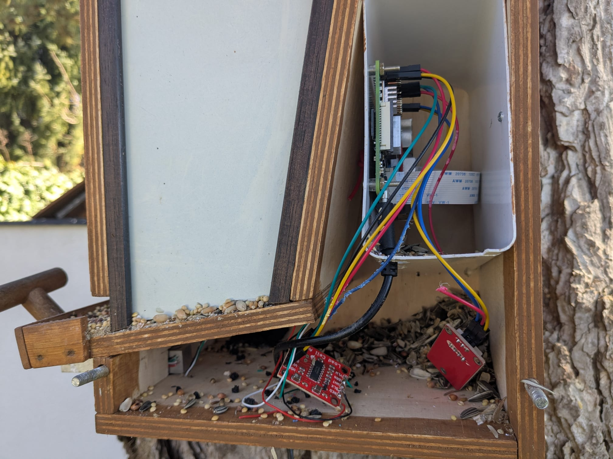
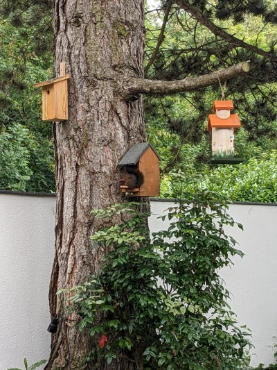
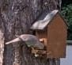
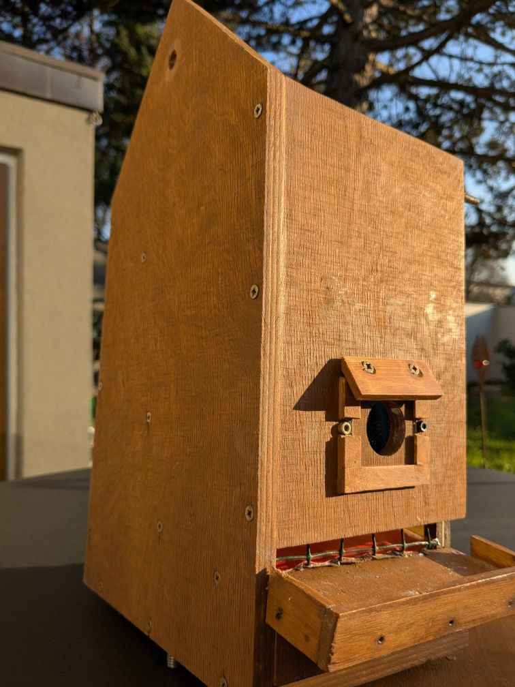
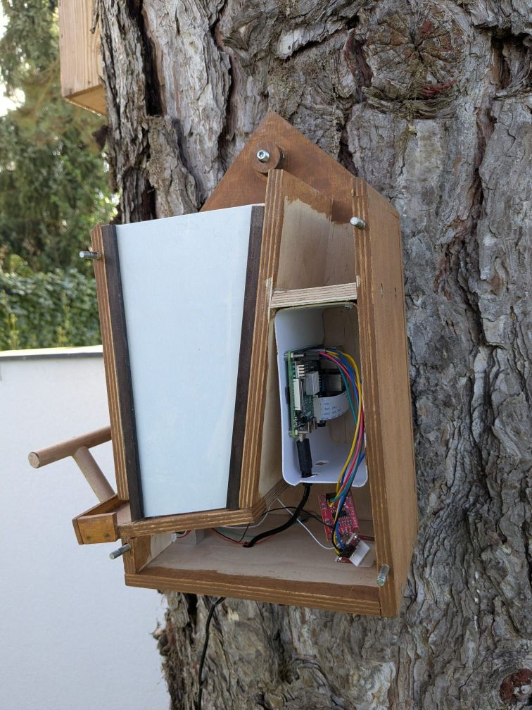
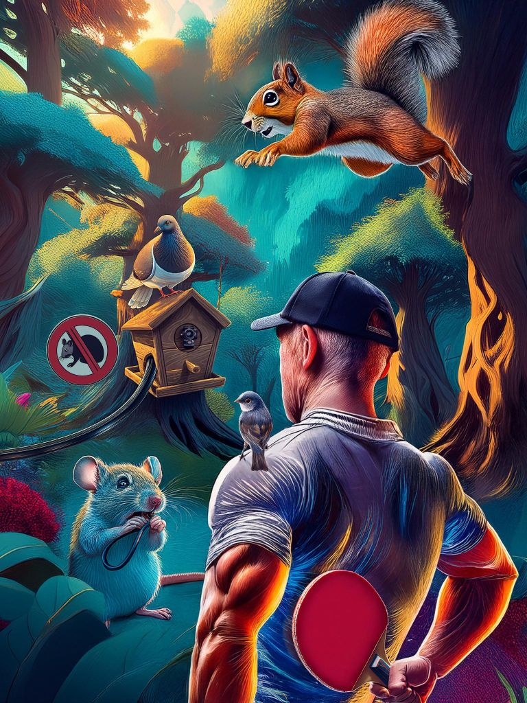

<!--keywords[Holzhaus,Mausschaden]-->
 

Allerlei Kleintiere wie Spechte und Eichhörnchen unterziehen das Vogelhaus immer wieder einer gründlichen Inspektion. Im März 2025 bekam das Vogelhaus eine gründliche Überarbeitung, nachdem eine Maus die Kabel zerfressen hatte. Der Elektronikraum wurde nach oben abgedichtet und der Futterauslass mit Hasengitter versehen. Zwei weitere Änderungen waren besonders nützlich: 1) der Austausch des leicht eintrübenden Acrylglases vor der Kamera durch ein Fensterglas machte einen deutlichen Unterschied. 2) Besser ins Bild kamen die Vögel durch eine breitere und höhere Sitzstange: waagrecht 9cm (früher 6cm), schräg-vertikal 7cm (früher 5cm). Eine breitere Sitzstange lädt aber auch taubengroße Vögel ein .

Ich danke Andreas Mischko für den engagierten Aufbau und auch die Restaurierung des Vogelhauses.

Die originale Bauanleitung der Uni Münster findet sich [hier] (https://herbbetz.github.io/betzBirdiary/station3/docs/birdhouse/Anleitung_Eigenbau_v3.html).

3D-Modelle sind [hier](https://herbbetz.github.io/betzBirdiary/station3/docs/birdhouse/3Dmodels/view-glb.html).