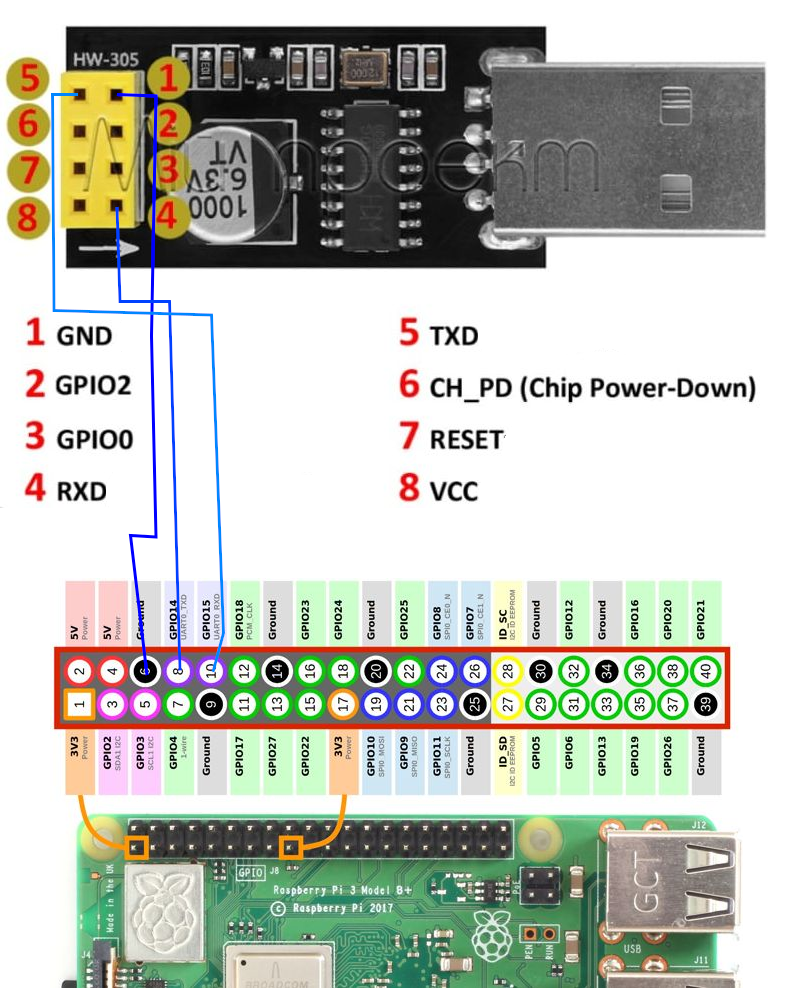

<!--keywords[booterror,debug,HDMI,kermit,minicom,screen,SDkartenschonung,UART]-->

**Boot Debugging des Raspberry 4B SBC**

- vor dem Netzwerk gibt es Meldungen über Mikro-HDMI / USB-Keyboard

- das UART-Interface (Baud rate 115200-8N1) kann den Bootprozess noch vor dem Laden des Linuxkernel loggen.
  - Terminal Programm:

    -  Windows: Putty, Terra Term -> Filereceive auf RPi mit *ZMODEM*-Tools (`apt install lrzsz`)
    -  Ubuntu: screen, minicom (includes kermit) -> Filereceive mit *ZMODEM*, z.b. via `minicom-kermit`

  - Ubuntu:  Monitoring des USB-TTL-Adapters mit `sudo dmesg -w` und `ls -l /dev/ttyUSB0`, `sudo screen /dev/ttyUSB0 9600` bzw. `sudo minicom -s` und `sudo minicom -D /dev/ttyUSB0 -b 115200` ermöglicht UART-Login in den Raspberry.
  
  - `enable_uart=1` in `/boot/firmware/config.txt` (diet-config advanced -> in cmdline.txt `console=tty1 console=serial0,115200`), dann `ls -l /dev/serial0`. Testsendung mit `echo "hello" > /dev/serial0`. Die Dateiübertragung via UART geschieht aus `minicom-kermit`, wenn auf dem Raspberry ein Kermit als Empfänger eingerichtet ist:
  
    ````
    sudo apt install ckermit
    cd ~/files
    kermit -r
    ````
  
    
  
  - USB-TTL-Adapter: Adapter TX → Pi GPIO 15 (RXD); Adapter RX → Pi GPIO 14 (TXD); Adapter GND → Pi GPIO any GND


  - https://itsfoss.com/use-uart-raspberry-pi/ , typische Adapterchips: CH340G, CP2102, FT232,

    https://www.amazon.de/AZDelivery-AZDELFTDI-CH340-USB-Konverter/dp/B07N7MC999/ref=asc_df_B07N7MC999

  - Adapter Outputs: TX, RX, GND, 5V, 3V

  - old adapter for ESP-01 programming, Windows and Ubuntu usually have driver support for CH340G.

    This adapter corresponds to the ESP-01 pinout, which you can stack directly on it (https://www.youtube.com/watch?v=6uaIWZCRSz8).
    
    
Hab den alten Adapter aber so nicht zum Laufen gebracht, sondern stattdessen diesen:
- https://www.pollin.de/p/joy-it-usb-ttl-schnittstellenwandler-811109


**SD Card Schonung**

- Das 7-fache Blinken beim Booten bedeutet ein Problem beim Hochfahren, meist durch Schädigung der SD card, die unter Windows noch lesbar sein kann, aber nicht mehr das `boot/kernel8.img` lädt.
- Maßnahmen zur Schonung der SD-Karte:
	- `camdata.json` über `ramdisk` schreiben (mainFoBird) und lesen (flaskBird), ebenso `statist/apidata.json`.
	- Logdateien während Produktivbetrieb nach `/dev/null` (startup.sh, ,mdroid.sh, crontab)