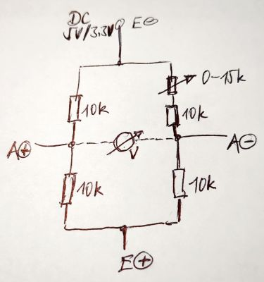
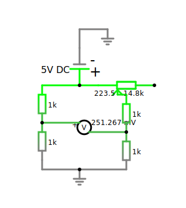
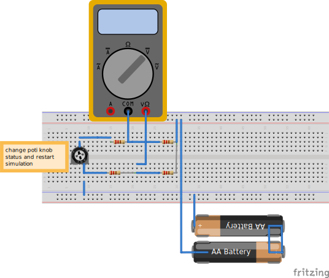

<!--keywords[ADC,Falstad,Fritzing,Dehnmesstreifen,Hx711,load_cell,Wheatstone]-->

Mit [Falstad](https://www.falstad.com/circuit/) kann man folgende Schaltung für den [Dehnmesstreifen](https://circuitjournal.com/four-wire-load-cell-with-HX711) (strain gauge, load cell) imitieren und den hx711 mit einem Potentiometer testen. Die Simulation zeigt, dass bei 5V DC, selbst wenn die Widerstände der wheatstone Widerstandsanordnung nur 100 Ohm betrügen, nur eine Spannung von 2.5 V für den Raspi Messeingang resultiert.

  