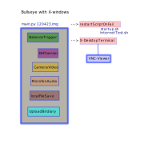

<!--keywords[Entwicklung,Historie,making_of,Versionen]-->

This is my personal fork of the bird station software for [https://www.wiediversistmeingarten.org/view](https://www.wiediversistmeingarten.org/view) . I thank the team at the University of Münster for their project and their support via email and discord.

I used their image *station120423.img* from [https://www.wiediversistmeingarten.org/api/image](https://github.com/Birdiary/station), for which they recommend using the Raspberry 4.

I had difficulties using the image on RaspberryZero2W. Therefore I modified their code.

##### Code of their *station120423.img*:

My description of *station120423.img* is as follows:

- The balance sensor (strain gauge feeding in to hx711 ADC) triggers the legacy Picamera and I2S microphone to make a video and audio of a bird sitting and feeding on the birdhouse balance. This is uploaded to the Birdiary website along with the DHT sensor data.
- All the sensors work together within the main.py script. If this script fails, it is restarted by the system. The working of the scripts can be observed from an X-Windows terminal using VNC.
- The setup uses the legacy Picamera, not Picamera2 preinstalled with bullseye. Picamera2 can only flip and no longer rotate the picam's image, if you happen to have your Picam mounted sideways in your birdhouse.
- for the HX711 sensor the Tatobari library is used: https://github.com/tatobari/hx711py
- for the DHT20 sensor the Adafruit Library is used. This is, where my problems started. I found out, that on RPi02W only the deprecated former version of it would work: https://github.com/adafruit/Adafruit_Python_DHT.git

##### My fork of the code:

So with time I found myself motivated to modify the code quite a bit. I tried it on RPi02W, but to rule out problems due to weak CPU multiprocessing, I also tried on RPi4B. To track down my problems, I looked for test scripts for each sensor individually. Finally I ended up using Raspbian Bullseye 32bit without X-Windows. I separated the code for each sensor as much as possible, which made it necessary, to use inter-process-communication (FIFO) between the scripts. As a replacement for the VNC observer, I installed a webserver (Flask). It can be read by any browser on http://my-birdhouse-ip4:8080 . My setup can be visualized as follows:

I was successfully using Picamera2 code (hardware pi camera 1.3) and the pigpio library (https://abyz.me.uk/rpi/pigpio/download.html) in this setup. Pigpio needs a demon in the background, but can be used for DHT20 as well as HX711 sensors.

I found the balance HX711 system to be the most sensitive of the project and could now have it restarted on its own in case of failure.

To avoid uploading too many failed videos to birdiary, I finally chose a setup, which asked for my confirmation within the browser before the upload. This setup is only a slight modification of the above:

##### What next:

To make my life simpler, I left out the microfon and only upload a minimal .wav at the moment, which is required by the birdiary site. Maybe some day, another .wav could replace this minimal. Raspberry could recognize bird sounds and collect them in the .wav for upload. Birds are not very talkative while feeding anyway. The current code uses under 10% of CPU power on RPi4B.

The FIFO could also be triggered by another web client, that is interested in the picam's view. My birdhouse seemed to be of interest mainly to chickadees, many other bird species ignored it.

##### Finally:

My modular approach is meant for being flexible in trying out new hardware and software. Remember that there is no GPIO locking, so do not let several processes talk to the same GPIO. Also watch carefully the thin soldered connections of the strain gauge to the HX711 circuit. Comments on my software are always welcome 😊.

Landshut/Germany in June 2024,

herber7be7z@gmail.com
