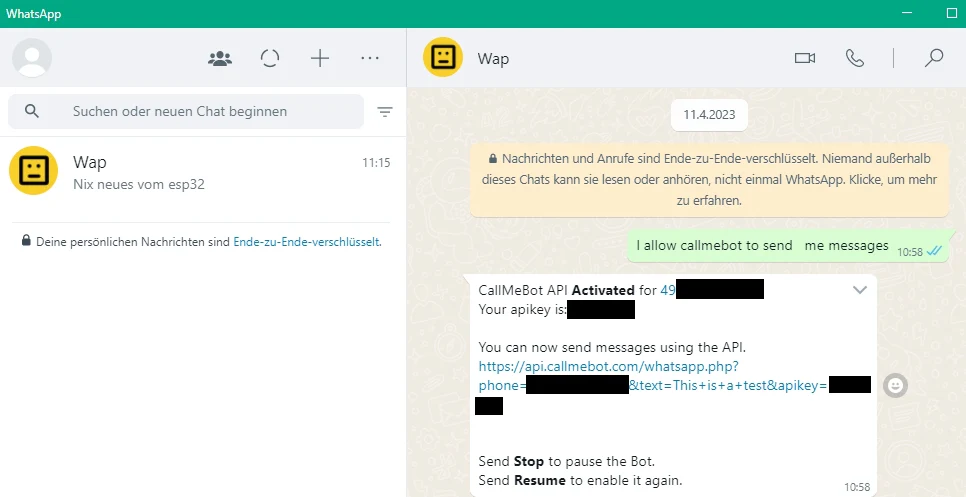

<!--keywords[MacroDroid,Messenger, Whatsapp]-->

## Messages der Vogelstation an Whatsapp

1. Den Bot auf Whatsapp einrichten:

   [Quelle](https://www.az-delivery.de/blogs/azdelivery-blog-fur-arduino-und-raspberry-pi/nachrichten-versenden-mit-esp32-und-esp8266-in-micropython-teil-4-whatsapp)

   - Füge auf dem Handy folgende Nummer zu den Kontakten hinzu:
    +34 644 86 70 49 . Gib einen beliebigen Namen dazu ein wie "whatsappbot".
     
    - Sende über WhatsApp folgenden Text an den neuen Kontakt:
   **allow callmebot to send me messages**

    - Kurze Zeit später kommt eine Nachricht mit Deinem API-Key:
   

   - Gib folgendes in die Addresszeile eines Browsers ein, mit Deinen Daten anstelle der 'XXXXXXXX':
   https://api.callmebot.com/whatsapp.php?phone=49871XXXXXXX&text=vonBirdiary&apikey=XXXXXXXX

   - Jetzt solltest Du eine Whatsapp Message bekommen.

2. Trage Deine Daten in station3/config.json ein, ebenfalls anstelle der 'XXXXXXXX' dort. Teste das mit './mdroid.sh' aus der Kommandozeile.

   Mit ein paar Minuten Latenz sendet Dir Deine Station eine Whatsapp.

Andere Messenger wie Signal haben ähnliche Anleitungen. Die App MacroDroid für Android sendet Messages der Station ohne Latenz.